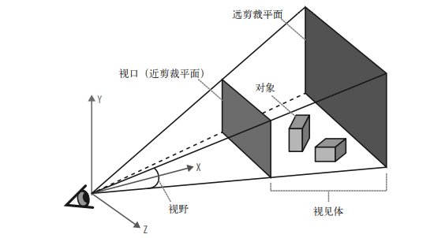

HTML5与WebGL编程 目录
[TOC]
***

# 前言

- 笔记总结
- `WebGL`是基础，后续为`Gis`，游戏
- 核心点：
  - `3D`渲染
  - `Three.js`引擎
  - `3D`动画
  - `CSS`高级效果
  - 常见`3D`流程，建模
  - `3D`框架
  - 开发应用

# 推荐阅读

- 《HTML5与WebGL编程》

# 1. 基础部分

## 1.1 介绍

- `WebGL`支持硬件`3D`加速渲染
- `requestAnimationFrame()`诞生，防止绘图残影

## 1.2 网格、多边形、顶点

- 网格：多个多边形构造，为模型
- 多边形：最小单位
- 顶点：多边形的顶点

## 1.3 材质、纹理、光源

- 材质：网格的外观属性
- 光源：材质的展现，明暗、反射
- 纹理：外观样式，色彩属性

## 1.4 变换和矩阵

- 变换：顶点位置变换
- 矩阵：`3D`变换通常由一个变换矩阵表示

$$
\left(
\begin{matrix}
a & b \\
c & d
\end{matrix}
\right)
$$


## 1.5 相机、透视、视口和投影

- 相机：用户观察点
- 透视：看物体的大小



## 1.6 着色器

- 着色器：渲染出一个网格的最终图像，需要准确定义顶点、变换、材质、光源和相机是如何作用并生成最终的图像
- 着色器实现了将网格像素点投影到屏幕上的算法
- 图形硬件能解析顶点、纹理和其他底层，但不能处理材质、光源、变换和相机，需要有着色器程序处理
- 着色器使用类`C`语言编写，叫做`shader`，被编译成可以被图形处理单元`GPU`执行的代码

- 有了着色器，可以精准控制每一个像素和图像渲染
- 和`CSS`自定义滤镜都使用了`OpneGL ES`的`GLSL ES`

## 2.1 实时渲染

- `3D`和`2D`不同，主要通过解析数据和`shader`来进行绘制，没有`2D`的丰富`API`

## 2.2 应用剖析和流程步骤

- `WebGL`就是个绘图库，另类`canvas`

### 执行步骤

1. 创建`canvas`
2. 获取`canvas`的绘图上下文
3. 初始化视口
4. 创建带渲染数据的缓冲（顶点数据）
5. 创建顶点缓冲到屏幕空间转换规则的矩阵
6. 实现绘制算法的着色器
7. 初始化着色器
8. 绘制

## 2.3 例子

```js
let canvas = document.getElementById('canvas');
let gl = initWebGL(canvas);
initViewport(gl, canvas);

// 2. 获取上下文
function initWebGL(canvas){
    let gl = null,
        msg = `don't support`;
    
    try{
        gl = canvas.getContext('experimental-webgl');
    }catch(err){
        msg += err;
    }

    if(!gl){
        alert(msg);
        throw new Error(msg);
    }

    return gl;
}

// 3. 视口
function initViewport(gl, canvas){
    gl.viewport(0,0,canvas.width,canvas.height);
}

```


### 缓冲、缓冲数组、类型化数组

- 图元：不同类型的基本几何图形
- 基于图元绘制，三角形、点、线
- 三角形是常用的图元类型，用两种形式存储：
  - 三角形集
  - 三角形带
- 缓冲：图元以数组的形式存储数据，顶点数据在数组内定义

#### 创建一个正方形

- 结果在包含顶点的缓冲数据的`JS`对象返回
- 对象内容：
  - 顶点结构的长度
  - 待绘制的顶点数量
  - 图元类型
- `Float32Array`是专门为`WebGL`引入的新数据类型，是一种缓冲数组（类型化数组），以二进制方式存储，速度更快，内存更小，解决了性能瓶颈

```js
// 4. 构建顶点数据
function createSquare(gl){
    let vertexBuffer;

    vertexBuffer = gl.createBuffer();
    gl.bindBuffer(gl.ARRAY_BUFFER, vertexBuffer);

    let verts = [
        .5, .5, 0.0,
        -.5, .5, 0.0,
        .5, -.5, 0.0,
        -.5, -.5, 0.0
    ];

    gl.bufferData(gl.ARRAY_BUFFER, new Float32Array(verts), gl.STATIC_DRAW);

    let square = {
        buffer: vertexBuffer,
        vertSize: 3,
        nVerts: 4,
        primtype: gl.TRIANGLE_STRIP
    };

    return square;
}
```

### 矩阵

- 绘制前需要创建一对矩阵
- 矩阵用于定义正方形相对相机的位置，被叫做模型-视图矩阵
- `4x4`矩阵使用一个包含16个元素的`Float32Array`对象来表示
- 推荐`glMatrix`
- [glMatrix](https://github.com/toji/gl-matrix)
- `glMatrix`矩阵统一以`mat4`类型表示

```js
// 5. 创建规则
let projectionMatrix, modelViewMatrix;

function initMatrices(canvas){
//    创建一个模型-视图矩阵，包含一个位于(0,0,-3.333)的相机
    modelViewMatrix = mat4.create();
    mat4.translate(modelViewMatrix, modelViewMatrix, [0,0,-3.333]);

//    创建一个45度角视野的投影矩阵
    projectionMatrix = mat4.create();
    mat4.perspective(projectionMatrix, Math.PI / 4,
        canvas.width / canvas.height, 1, 10000);
}
```

### `shader`

- 着色器-`GLSL`
- 着色器由两部分组成：顶点着色器和片段着色器
- vertext shader: 将物体的坐标转换为`2D`显示的坐标
- fragment shader: 颜色输出
- `GLSL`代码可以放在`js`字符串中，或者是`AjAX`加载外部文件，或者是放在隐藏`DOM`中

```js
// 6. shader
let vertexShaderSource = `
    attribute vec3 vertexPos;\n
    uniform mat4 modelViewMatrix;\n
    uniform mat4 projectionMatrix;\n
    void main(void) {\n
        //返回经过投影和变换的顶点值\n
        gl_Position = projectionMatrix * modelViewMatrix *\n
            vec4(vertexPos, 1.0);\n
    }\n
`;

let fragmentShaderSource = `
    void main(void) {\n
        //返回像素点的颜色:始终输出白色\n
        gl_FragColor = vec4(1.0,1.0,1.0,1.0);\n
    }\n
`;
function createShader(gl, str, type) {
    let shader;

    if (type == 'fragment'){
        shader = gl.createShader(gl.FRAGMENT_SHADER);
    }else if (type == 'vertex'){
        shader = gl.createShader(gl.VERTEX_SHADER);
    }else {
        return null;
    }

    gl.shaderSource(shader, str);
    gl.compileShader(shader);

    if (!gl.getShaderParameter(shader, gl.COMPILE_STATUS)) {
        alert(gl.getShaderInfoLog(shader));
        return null;
    }

    return shader;
}
```

- 着色器的各个部分被编译完成，需要调用`gl.createProgram(), gl.attachShader(), gl.linkProgram()`链接到同一段程序里
- 用`gl.getAttribLocation(), gl.getUniformLocation()`获取`GLSL`中定义的各个变量的句柄

```js
// 8. 着色器初始化
let shaderProgram,
    shaderVertexPositionAttribute,
    shaderProjectionMatrixUniform,
    shaderModelViewMatrixUniform;

function initShader(gl) {
//    加载并编译片段和顶点着色器
    let fragmentShader = createShader(gl, fragmentShaderSource, "fragment");
    let vertexShader = createShader(gl, vertexShaderSource, "vertex");

//  将它们链接到一段新程序中
    shaderProgram = gl.createProgram();
    gl.attachShader(shaderProgram, vertexShader);
    gl.attachShader(shaderProgram, fragmentShader);

    gl.linkProgram(shaderProgram);

//    获取指向着色器参数的指针
    shaderVertexPositionAttribute =
        gl.getAttribLocation(shaderProgram, "vertexPos");

    gl.enableVertexAttribArray(shaderVertexPositionAttribute);

    shaderProjectionMatrixUniform =
        gl.getUniformLocation(shaderProgram, "projectionMatrix");

    shaderModelViewMatrixUniform =
        gl.getUniformLocation(shaderProgram, "modelViewMatrix");

    if (!gl.getProgramParameter(shaderProgram, gl.LINK_STATUS)) {
        alert("Could not initiialise shaders");
    }
}
```


### 绘制图元

- `draw(R,G,B,Alpha)`
- `gl.cleear()`
- 颜色缓冲：`GPU`显存中用于渲染屏幕上像素点的区域

```js
//9.绘制
function draw(gl, obj){
//    清空背景,使用黑色填充
    gl.clearColor(0.0,0.0,0.0,1.0);
    gl.clear(gl.COLOR_BUFFER_BIT);

//    设置待绘制的顶点缓冲
    gl.bindBuffer(gl.ARRAY_BUFFER, obj.buffer);

//    设置待用的着色器
    gl.useProgram(shaderProgram);

//    建立着色器参数之间的关联：顶点和投影/模型矩阵
    gl.vertexAttribPointer(shaderVertexPositionAttribute,
        obj.vertSize, gl.FLOAT, false, 0,0);
    gl.uniformMatrix4fv(shaderProjectionMatrixUniform, false,
        projectionMatrix);
    gl.uniformMatrix4fv(shaderModelViewMatrixUniform, false,
        modelViewMatrix);

//    绘制物体
    gl.drawArrays(obj.primtype, 0, obj.nVerts);
}
```

## 2.4 创建`3D`

### 初始化立方体、颜色和索引缓冲的代码

```js

```

