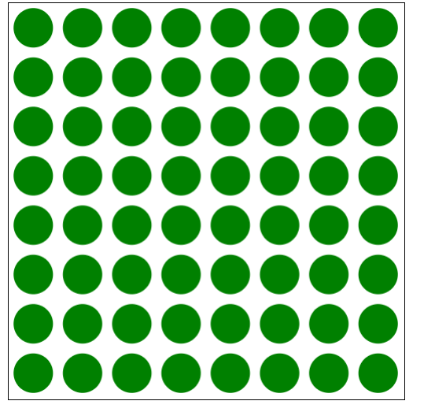

[TOC]

# 读书笔记

## 前言
### 工作四原则

第一个习惯，在操作系统上，把英语作为母语。
第二个习惯，在日常工作中，用英语作为搜索语言。
第三个习惯，则是付费去科学上网
第四个习惯，用正确的中英文排版写文章

### 推荐论坛

- [Medium](https://medium.com/)
- [掘金](https://juejin.cn/)
- [语雀](https://www.yuque.com/explore/headlines)

### 目标读者
* 有一定的编程经验。
* 仅是记录个人觉得重点，不适用所有人。
### 推荐
* MDN
* 推书：《JavaScript权威指南》

## 第一个应用

### JQuery

```javascript
$(document).ready(function {
	'use strict';
	console.log('main.js loaded.');
})
```

### 绘制图元

#### H5常见图形库推荐
##### 常用H5 canvas：
* [Paper.js](http://paperjs.org/tutorials/ "Paper.js Tutorials")
* [KineticJS](https://github.com/ericdrowell/KineticJS/ "KineticJS Github")
* [Fabric.js](http://fabricjs.com/docs/ "Fabric.js Docs")
* [EaseJS](http://www.createjs.cc/easeljs/ "CreateJS Page")

##### PaperJS试用

- 安装paper.js
```javascript
npm install paper
```

- body里创建标签
	- main.js, index.html, main.css
	- 载体
```html
<canvas id="mainCanvas"></canvas>
```
```css
#mainCanvas {
	width: 400px;
	height: 400px;
	border: solid 1px black;
}
```
- 引入JQuery and Paper.js(paper[官网](http://paperjs.org/tutorials/ ))

paper:
```html
<script src="https://cdnjs.cloudflare.com/ajax/libs/paper.js/0.9.24/paper-full.min.js"></script>
```
**注意**
- 引入js的顺序很重要。
- 先jq，再paper.js

引入后的配置：
- 样板代码：使用工具类库前的初始化设置。

```javascript
//main.js
paper.install(window);
paper.setup(document.getElementById('mainCanvas'));

//to do
paper.view.draw();
```
讲解：
- 第一行将paper.js注册为全局变量
- 第二行附在canvas上，准备绘图
- to do为代码编写区域
- 最后一行，绘画

###### 绘制绿色圆
```javascript
//main.js
'use strict'

paper.install(window);
paper.setup(document.getElementById('mainCanvas'));

var c = Shape.Circle(200, 200, 50);
c.fillColor = 'green';

paper.view.draw();
```
- css里width,height: 400px
- circle(x, y, r)
- fillColor(color)

sample:


###### 多个圆情况
```javascript
'use strict'

paper.install(window);
paper.setup(document.getElementById('mainCanvas'));

var c;
for(var x = 25; x < 400; x += 50){
	for(var y = 25; y < 400; y += 50){
		c = Shape.Circle(x, y, 20);
		c.fillColor = 'green';
	}
}

paper.view.draw();
```
sample:


###### 用户输入
根据用户而出现的情况：
```javascript
var userInputTool = new Tool();

userInputTool.onMouseDown = event => {
	var c = Shape.Circle(event.point, 20);
	c.fillColor = 'green';
}
```
- onMouseDown: 用户按下鼠标事件。
- event.point: 事件的位置。

sample:


###### 文本文字
具有表现力的`Hello World`
```javascript
var c = Shape.circle(200,200,80);
c.fillColor = 'black';

var text = new PointText(200, 200);
text.justification = 'center';
text.fillColor = 'white';
text.fontSize = 20;
text.content = 'Hello World';
```
sample:


## 常用开发工具
- Git
- Node and npm
- Gulp / Grunt: 任务自动化工具
- Babel: 转换编译器(ES6->ES5)
- ESLint: 格式检查工具

### 版本控制

不想被git追踪文件：
- 创建.gitignore文件
- 添加内容：`.bak`

* JSX: 基于XML扩展的JavaScript

## 字面量、数据类型、命名法

## 命名法
- 驼峰命名法：anUd
- 蛇型命名法：curr_tmp_c

## 正则
* 邮件识别器
* 手机号码识别器
```javascript
const email = /\b[a-z0-9._-]+@[a-z_-]+(?:\.[a-z]+)+\b/;
const phone = /(:?\+1)?(:?\(\d{3}\)\s?|\d{3}[\s-]?)\d{3}[\s-]?\d{4}/;
```

## 函数的引用调用
- 函数是一个对象
- js遇到圆括号跟在值后面，就会当作函数

```javascript
function get(){}
const f = get;
f();	//get()
```
### 函数重载
- js中，无论参数如何改变，函数都是同一个

### 默认参数
```javascript
function f(a, b = "default", c = 3){}
```

### 函数作为对象属性
```javascript
const o = {
	name: "wallace",
	bark(){}
}
```

### this绑定问题
- this：由方法如何被调用所决定，而非函数定义所决定。
```javascript
const speak = o.speak;
speak === o.speak;
speak();
```

- this的绑定会存在问题
```javascript
const o = {
	name: "Julie",
	greetBackwards(){
		function getReverse(){
			return this.name;
		}
	}
}
//this绑定undefine
o.greetBackwards();
```
- 需要在函数中特意绑定一个值
```javascript
const o = {
	name: "Julie",
	greetBackwards(){
		const self = this;
		function getReverse(){
			return self.name;
		}
	}
}

o.greetBackwards();
```

### 调用、请求、绑定

#### call绑定
- call方法允许在调用函数时，给this绑定一个对象
- call的第一个参数是想要绑定的值，剩下的参数则变成要调用的函数的参数
```javascript
const bruce = {name : "Bruce"};

function greet(){
	return 'Hello, I'm ${this.name}'';
}

function update(birthday, occupation){
	this.birthday = birthday;
	this.occupation = occupation;
}

greet(); //undefine
greet.call(bruce); //绑定了'bruce'

update.call(bruce, 1949, 'singer');
```

#### apply方法
##### 与call的比较
- apply与call基本一致
- call像一般函数一样直接获取参数
- apply以数组的方式获取参数
- apply适用于将数组作为为函数参数
```javascript
update.apply(bruce, [1995, 'actor']);
```
- apply与解构赋值

```javascript
const newBruce = [1940, "martial artist"];
update.call(bruce, ...newBruce);
update.apply(bruce, newBruce);
Math.min(...arr);
```

#### bind方法
- 允许指定this值得函数
- 给一个函数永久绑定this值
- 会变成一个潜在的bug
	- 函数实际上已经不能有效使用call, apply或者bind
- bind可以传递参数

```javascript
const updateBruce = update.bind(bruce, 1247);
updateBruce.call(madeline, "king");	//name依旧是bruce，而非madeline
```

## 函数、闭包和静态作用域

### 闭包
定义：将某个函数定义在一个指定的作用域中，并明确地指出它对该作用域所具备访问权限。
- 可以看作封闭了函数的作用域。
- 让原本封闭的作用域可以被外界访问
sample:
```javascript
let globalFunc;
{
	let blockVar = 'a';
	globalFunc = function() {
		console.log(blockVar);
	}
}

globalFunc();	//print 'a'
```
- globalFunc 在块内被赋值
- 该块（包括它的父作用域，即全局作用域）构成了一个闭包
- 函数被定义在指定作用域内，并在该作用域外被引用，该函数有该作用域的访问权限


## 即时调用函数表达式(IIFE)

sample:
```javascript
(function(){
	//....
})();
```
### IIFE的好处
- 任何内部消息都有自己的作用域
- 向作用域外传递消息
```javascript
const message = (function() {
	const secret = "I'm a secret!";
	return `The secret is ${secret.length} long.`;
})();
console.log(message);
```

#### 内部统计被调用次数
- 外界无法篡改，所以能记录被调用的次数
```javascript
const f = (function (){
	let count = 0;
	return function(){
		return `called ${++count} time(s).`;
	}
})();

f();	// 1
f();	// 2
```

## 函数作用域和提升
- 任何使用var声明的变量都会被提升至作用域的顶部

## 数组

### 添加或删除
- push, pop -> 数组最后一个
- shift, unshift -> 数组第一个

### 数组内的分割和替换-copywithin
- copywithin: 数组中一串有序的元素复制到数组的另一个位置
- 1st argu, 目标位置
- 2st argu, 从哪里开始

### 指定值填充数组-fill
fill: 将一个固定值赋给数组中任意位置元素
- 还可以指定具体位置.
```javascript
const arr = new Array(5).fill("c", 2, 4);
```

### map, filter
- 这两个都是返回数组的拷贝
- map遍历，filter增加筛选条件，删除后的数组
```javascript
const cart = [{name: "Widget", price: 9.95}, {name: "Gadget", price: 22.95}];
const names = cart.map(x => x.name);
```

### reduce
- 集合了map与filter的优势
- 可以实现判断
```javascript
const arr = [5, 7, 2, 4];
const sum = arr.reduce((a, x) => a += x, 0);
```

## 对象

### Object.keys
- 提供了一种方式用来获取对象中所有可枚举的字符串属性，并将其封装成一个数组
```javascript
const o = {a:1, b:2, c:3};
Object.keys(o).forEach(prop => console.log(o[prop]));
```

### 原型
在类的实例中，当引用一个方法时，实际是在引用原型方法。
- `Array.prototype.forEach` ->`Array#forEach`
- 对于对象构造器函数，`prototype`至关重要

### 动态调度
- 如果属性或方法不存在当前对象中，js会检查是否在对象原型中
- 该类的所有实例都可以访问这个属性或方法

### 多态
- `JavaScript`中所有对象都是基类Object的实例

## maps, sets

### maps
sample:
```javascript
const userRoles = new Map();

userRoles.set(u1, 'User');
userRoles.get(u1);
userRoles.has(u1);
userRoles.size;
userRoles.keys();
userRoles.values();
userRoles.entries(); //获取所有键值对

```
### weak maps
- 与map本质相同
不同：
- key必须是对象
- weakmap不能迭代或清空
- 主要用于存储对象实例中的私有key
```javascript
const SecretHolder = (function() {
	const secrets = new WeakMap();
	return class {
		setSecret(secret) {
			secrets.set(this, secret);
		}
		getSecret() {
			return secrets.get(this);
		}
	}
})();
```

### sets
- 不允许重复数据的集合

### weak sets
- 唯一用处是判断给定对象在不在一个set中

## 异常和错误处理

### Error对象
```javascript
const err = new Error('Invalid email.');
```

### 抛出异常
```javascript
throw new Error('xxx');
```

### try...catch...finally
```javascript
try{

}catch(err){
	console.log(err.stack);
}finally{
		console.log('xx');
}
```

## 迭代器和生成器

### 迭代器
- 迭代器：帮助用户追踪当前的位置
```javascript
const book = [1, 2, 3, 4];
const it = book.values();

it.next();	//1, done: false
it.next();	//2
it.next();	//3
it.next();	//4
it.next();	//undefined, done: true
it.next();	//undefined, done: true
```

### 迭代协议
- 让任何对象变得可迭代。
- 如果一个类提供了一个符号方法Symbol.iterator，这个方法返回一个具有迭代行为的对象

### 生成器
- 使用迭代器来控制其运行的函数
- 函数执行时，对函数进行控制

#### 生成器与一般函数的不同
- 函数可以通过yield，在运行的任意时刻将控制权交换给调用方
- 调用生成器时，并非立即执行，而是会回到迭代器中，在调用迭代器的next时执行
- 不能用箭头符号创建生成器
sample:
```javascript
function* rainbow(){
	yield "red";
	yield "blue";
}

const it = rainbow();

it.next();	//value: "red", done: false
```

### yield表达式和双向交流
```javascript
function* interrogate() {
	const name = yield "What is your name?";
	const color = yield "What is your favorite color?";
	return `${name}'s favorite color is ${color}.'`;
}

const it = interrogate();
it.next();
it.next('Ethan');
it.next('orange');
```

#### 生成器和返回值
- yield本身并不能让生成器结束
- return 会让done立刻变为true
- for..of..中，不会打印return的值

#### 生成器意义
- 函数容易控制和定制化
- 函数调用方不再局限于提供数据后等待函数返回

## 函数
### 纯函数
- 纯函数：对同一组输入，始终返回相同的结果

### IIEFs and 异步代码
- 在一个全新的作用域中创建新变量
倒计时sample:
```javascript
for(let i = 5; i >= 0; i --){
	setTimeout(function(){
		console.log(i===0 ? "go!" : i);
	} , (5 - i) * 1000);
}
```

### 数组中的函数
图形变换sample:
```javascript
const sin = Math.sin;
const cos = Math.cos;
const theta = Math.PI / 4;
const zoom = 2;
const offset = [1, -3];

const pipeline = [
	function rotate(p) {
		return {
			x: p.x * cos(theta) - p.y * sin(theta),
			y: p.x * sin(theta) + p.y * cos(theta)
		};
	},
	function scale(p) {
		return {x: p.x * zoom, y: p.y * zoom};
	},
	function translate(p){
		return {x:p.x + offset[0], y: p.y + offset[1];};
	},
];

const p = {x:1, y:1};
let p2 = p;
for(let i = 0; i < pipeline.length; i ++){
	p2 = pipeline[i](p2);
}
```

### 函数传给函数
- 异步编程
- 回调函数

### 函数中返回函数
- 柯里化：接收多个参数的函数转换成接收单个参数的函数
- 参考例子：Express，Koa的中间件

## 异步编程
- JS对异步编程的支持有三个不同的阶段：
	- 回调(callback)
	- 承诺(Promise)
	- 生成器(Generator)
- 生成器本身不提供任何对异步的支持，依赖于承诺或特定类型的回调来提供异步行为
- 承诺依赖于回调
- 回调具有对象而变得更有用

### 常用场景
- 网络请求(Ajax请求)
- 文件系统操作(读/写文件等)
- 时间延迟功能(警告)

### 回调
- 回调都是匿名函数
- 代码的编写顺序与实际执行的顺序之间没有必然联系
- 异步的主旨在于，不会阻塞任何事

#### setTimeout
- 在运行过一次函数后就不再运行

#### setInterval and clearInterval
- 每隔一段特定的时间运行回调函数，并且一直运行下去，直到调用clearInterval
sample:
```javascript
const start = new Date();
console.log(start);
let i = 0;
const intervalId = setInterval(function() {
    let now = new Date();
    if(now.getMinutes() !== start.getMinutes() || ++i > 10){
        return clearInterval(intervalId);
    }
    console.log(`${i}: ${now}`);
}, 2 * 1000);
```

#### scope和异步执行
问题：
- scope和闭包是如何影响异步执行的？
    - 每当一个函数被调用时，都创建了一个闭包
    - 所有函数内部创建的变量(包括形参)只在有被访问的时候才存在
- 注意：
	- 回调函数的作用域：回调函数可以访问闭包内的所有内容

#### 错误优先回调
- 优先回调错误
- return err.
sample:
```javascript
const fs = require('fs');
const fname = 'filename';

fs.readFile(fname, (err, data) => {
	if(err)	return console.error(`${fname}:${err.message}`);
	console.log(`${fname} contents: ${data}`);
});
```

#### 回调地狱
- 回调管理异步执行，但却存在缺陷
- 当需要在执行过程中等待多个事件的时候，使用回调来管理就不够
sample: *读取三个不同文件中的内容，然后等待60秒，再把内容写进第4个文件*
```javascript
const fs = require('fs');

fs.readFile('a', (err, dataA) => {
    if (err)    console.err(err);
    fs.readFile('b', (err, dataB) => {
        if(err) console.err(err);
        fs.readFile('c', (err, dataC) => {
            if(err) console.log(err);
            setTimeout(() => {
                fs.writeFile('d', dataA + dataB + dataC, err => {
                    if(err) console.error(err);
                });
            }, 2 * 1000); 
        })
    })
});
```
- try...catch块只能在同一个函数的作用域内才会有效
- 没办法阻止回调函数被意外调用两次，或者压根没被调用

#### promise
- 为了弥补回调函数里，没办法处理多次回调的问题

##### 概念
- 在调用基于promise的异步函数是，会返回一个promise实例
- 两个事情：被满足、被拒绝
- promise只会发生一个事情，结果只有一次
- 完成出现结果后，就会被认为是处理了

##### 与回调的对比
- promise是对象，可以被传递

##### 创建promise
- 应该带有resolve(满足), reject的回调
- 即便使用promise，也需要回调函数
- 可以保证，不管是谁使用了promise，都会得到一个满足或者拒绝的响应
```javascript
function countdown(seconds){
	return new Promise((resolve, reject) => {
		for(let i = seconds; i >= 0; i --){
			setTimeout(() => {
				if(i > 0)	console.log(i + '...');
				else	resolve(console.log("Go!"));
			}, (seconds - i) * 1000);
		}
	});
}

countdown(5);
```

##### 使用promise
- 不用将返回的promise赋给一个变量，而是直接调用它的then处理器
- then有两个回调：
	- 满足的回调
	- 错误的回调
	- 至多只有一个会被调用
- 支持catch处理器
```javascript
function countdown(seconds){
	return new Promise((resolve, reject) => {
		for(let i = seconds; i >= 0; i --){
			setTimeout(() => {
				if(i > 0)	console.log(i + '...');
				else	resolve(console.log("Go!"));
			}, (seconds - i) * 1000);
		}
	});
}

countdown(5).then(
    () => {
        console.log("countdown completed successfully");
    },

    err => {
        console.log(err.message);
    }
).catch(
    err => {
        console.log(err.message);
    }
);
```
###### 缺点
- promise只是提供了一个定义极好，可以安全处理那些满足或者拒绝的异步任务的方式
- 不能报告过程进度的能力
- 只有成功与否，而没有50%进度

#### 事件
- 事件发射器可以广播事件

sample:
```javascript
const EventEmitter = require('events').EventEmitter;

class Countdown extends EventEmitter {
    constructor(seconds, superstitious){
        super();

        this.seconds = seconds;
        this.superstitious = superstitious;
    }
    
    go() {
        const countdown = this;

        return new Promise(
            (resolve, reject) => {
                for(let i = countdown.seconds; i >= 0 ; i --){
                    setTimeout(() => {
                        if(countdown.superstitious && i === 13)
                            return reject(new Error("Not counting."));
                        countdown.emit('tick', i);
                        if(i === 0)
                            resolve();
                    }, (countdown.seconds - i) * 1000);
                }
            }
        );
    }
} 
```

注意：
- 保存的`const countdown = this`是一个特殊变量，与回调中的this不是同一个东西
- 调用`countdown.emit('tick', i)`时，任何想要监听tick事件的人都可以监听它
sample:
```javascript
const EventEmitter = require('events').EventEmitter;

class Countdown extends EventEmitter {
    constructor(seconds, superstitious){
        super();

        this.seconds = seconds;
        this.superstitious = superstitious;
    }
    
    go() {
        const countdown = this;

        return new Promise(
            (resolve, reject) => {
                for(let i = countdown.seconds; i >= 0 ; i --){
                    setTimeout(() => {
                        if(countdown.superstitious && i === 13)
                            return reject(new Error("Not counting."));
                        countdown.emit('tick', i);
                        if(i === 0)
                            resolve();
                    }, (countdown.seconds - i) * 1000);
                }
            }
        );
    }
} 

const c = new Countdown(5);

c.on('tick', i => {
    if (i > 0)  console.log(i + '...');
});

const d = new Countdown(15, true)
	.on('tick', i => {
		if(i > 0)	console.log(i + '...');
	});

c.go()
    .then(
        () => console.log("Go!")
    ).catch(
        err => console.error(err.message)
    );
```

###### clearTimeout
- 用来清除所有pending的timeouts
- `clearTimeout`

#### promise链
- 可以被链式调用
- 当一个promise被满足的时候，可以立即用它调用另一个返回promise的函数
sample:
```javascript
function launch() {
    return new Promise(
        (resolve, reject) => {
            console.log("Lift off!");
            setTimeout(() => {
                resolve("In orbit.");
            }, 2 * 1000);
        }
    );
}

const c = new countdown(5)
    .on('tick', i => console.log(i + '...'));

c.go()
    .then(launch)
    .then(
        msg => {
            console.log(msg);
        }
    )
    .catch(
        err => console.error("We have a problem");
    )
```

#### 避免不被处理的promise
- 无法避免因为promise没有被处理而产生的问题
- 规避：给promise一个特定的超时
```javascript
function launch() {
    return new Promise((resolve, reject) => {
        if(Math.random() < 0.5) return; //超时返回
        console.log("Lift off!");

        setTimeout( () => {
            resolve("In orbit.");
        }, 2 * 1000);
    });
}

function addTimeout(fn, timeout){
    if(timeout === undefined)   timeout = 1000; //默认超时
    return function(...args){
        return new Promise((resolve, reject) => {
            const tid = setTimeout(reject, timeout,
                new Error("promise timed out."));
            fn(...args)
                .then((...args)  => {
                    clearTimeout(tid);
                    resolve(...args);
                })
                .catch((...args) => {
                    clearTimeout(tid);
                    reject(...args);
                });
        });
    }
}

c.go()
    .then(addTimeout(launch, 4 * 1000));
```

### 生成器
***尚未吃透，会出现很多问题***

- 生成器允许函数和其他调用方之间的双向通信
- 将node中错误优先的回调转化成promise的办法，封装成一个nfcall函数
```javascript
const { resolve } = require("path");

function nfcall(f, ...args) {
    return new Promise((resolve, reject) => {
        f.call(null, ...args, (err, ...args) => {
            if(err) return reject(err);
            resolve(args.length < 2 ? args[0] : args);
        });
    });
}
```

#### 生成器运行器
- 生成器不是天生异步的。
- 生成器允许函数和其调用方对话，可创建一个用来管理对话的函数
- 这个函数需要知道如何处理异步调用

```javascript
function grun(g) {
    const it = g();
    (function iterate(val) {
        const x = it.next(val);
        if(!x.done){
            if(x.value instanceof Promise){
                x.value.then(iterate).catch(err => it.throw(err));
            } else{
                setTimeout(iterate, 0, x.value);
            }
        }
    })();
}
```
##### 注意
- grun严重依赖于runGenerator
-  推荐阅读**Kyle Simpson**关于生成器的文章，作为此处补充

###### 生成器的实现
```javascript
function* theFutureIsNow() {
    const dataA = yield nfcall(fs.readFile, 'a');
    const dataB = yield nfcall(fs.readFile, 'b');
    const dataC = yield nfcall(fs.readFile, 'c');
    yield ptimeout(60 * 1000);
    yield nfcall(fs.writeFile, 'd', dataA + dataB + dataC);
}

grun(theFutureIsNow);
```
- 改变了原有的思维方式，运行也简单

## 日期和时间

### 与Java的联系
- Date对象和一个共同的语法祖先

### 时间戳
- valueOf转化
```javascript
const d = new Date();
console.log(d);
console.log(d.valueOf());
```

### Moment.js
- 功能强大且非常好用的日期类库
- Mozilla Developer Network
- Moment document
#### 引入
- `npm install -save moment-timezone`
```javascript
const moment = require('moment-timezone');

const d = new Date(Date.UTC(2016, 4, 27));
```

##### 服务器指定时区

```javascript
const d = moment.tz([2016, 3, 27, 9, 19], 'America/Los_Angels').toDate();
```

##### 日期的比较
```javascript
const d1 = new Date(1996, 2, 1);
const d2 = new Date(2009, 4, 27);

d1 > d2;	//false
```

##### 日期的四则运算
```javascript
const msDiff = d2 - d1;
const daysDiff = msDiff / 1000 / 60 / 60 /24;

```

## 浏览器里JS

### 文档对象模型
- DOM: 与浏览器交互核心，描述HTML的约定
- 每一个节点都是一个节点类
编写函数，实现从document开始，横向打印整个DOM的功能
```javascript
function printDOM(node, prefix) {
    console.log(prefix + node.nodeName);
    for(let i = 0; i < node.childNodes.length; i ++){
        printDOM(node.childNodes[i], prefix + '\t');
    }
}

printDOM(document, '');
```

- 这个递归实现了树的深度优先遍历，前序遍历
- 先遍历一个分支中的所有节点，然后才会遍历下一个分支
#### 缺点：
- 过程冗杂，效率低下
- DOM API: TreeWalker对象，提供了遍历DOM中所有元素的对象


### DOM中的GET方法

- document.getElementById
- document.getElementByClassName: 返回集合
- document.getElementByTagName: 返回tag名称的集合
注意
- 集合时HTMLCollection
- 返回的集合可以在for中循环迭代
- 不能使用Array.prototype方法，例如map, filter, reduce
- 通过展开操作符可以转为数组：`[...document.getElementBuTagName(p)]`

### CSS选择器定位元素，查询DOM元素
- querySelector
- querySelectorAll

### 操作DOM元素
- textContent
- innerHTML
- 这两个元素会替换掉元素中的所有内容

### 创建DOM元素
- document.createElement

#### 获取子节点并操作
```javascript
const parent = document.getElementById('content');
const firstChild = parent.childNodes[0];
//添加
parent.insertBefore(p1, firstChild);
parent.appendChild(p2);
```

### 样式元素
- `classList`包含该元素的所有class
- `classList.add('xx')`增加class名
- `classList.remove('xx')`移除

### 事件
- DOM API中包含了大约200个事件

### 事件的捕获和冒泡
- 最外层祖先结点捕获
- 父结点接触冒泡

#### 阻止调用
- preventDefault, 取消事件
	- 取消的事件会继续传播，但defaultPrevented属性会被置为true
- stopPropagation
- stopImmediatePropagation

#### 事件的传播-重要性
- 提前知道事件的传播并控制它
- **掌握事件传播机制是区分高级程序员和一般开发的区别**

### 事件的种类
- MDN里，DOM事件按照种类分组，一共6类

### 拖拽类
- 拖放事件的接口
- drag start, drag, dragend, drop

### 焦点事件
- 用户可以编辑的元素
- focus, blur, change

### 表单事件
- submit

### 输入设备事件
- 鼠标事件：click, mousedown, move, mouseup, mouseenter, mouseleave, mouseover, mousewheel
- 键盘事件：keydown, keypress, keyup
- 触摸事件是优先于鼠标事件的

### 媒体事件
- 用于追踪用户的交互
- pause, play

### 进度事件
- 通知浏览器网页加载进度
- load
- error

### 触摸事件
- touches


## AJAX
- 开启web2.0
- 核心概念：运行在浏览器端的JavaScript以可编程的方式将HTTP request发送到Server， server在返回所请求的数据
### server
```javascript
const http = require('http');

const server = http.createServer(function(req, res) {
    res.setHeader('Content-Type', 'application/json');
    res.setHeader('Access-Control-Allow-Origin', '*');
    res.end(JSON.stringify({
        platform: process.platform,
        nodeVersion: process.version,
        uptime: Math.round(process.uptime())
    }));
});

const port = 7070;
server.listen(port, () => {
    console.log(`Ajax server started on port ${port}`);

});
```

注意：
-  Ajax引入了一个漏洞，跨资源共享。
-  header, Access-Control-Allow-Origin的值为\*， 禁止CORS检查
- 产品环境中，网络协议、域名和端口号不同，指明endpoint的协议，域名和端口号

### 前台接收与发送代码：
```html
<div class="serverinfo">
        Server is running on <span data-replace="platform">???</span>
        with Node <span data-replace="nodeVersion">???</span>. It has
        been up for <span data-replace="uptime">???</span> seconds.

    </div>
<script type="application/javscript;version=1.8">
    function refreshServerInfo(){
        const req = new XMLHttpRequest();
        req.addEventListener('load', () => {
            console.log(this.responseText);
            const data = JSON.parse(this.responseText);
            
            const serverinfo = document.querySelector('.serverinfo');

            Object.keys(data).forEach(prop => {
                const replacements = serverinfo.querySelectorAll(`[data-replace="${prop}"]`);

                for(let r of replacements){
                    r.textContent = data[prop];
                }
            });
        });

        req.open('GET', 'http://localhost:7070/', true);
        req.send();
    }

    refreshServerInfo();
</script>
```

详解：
- 创建XMLHttpRequest
- 监听器监听load事件，AJAX调用成功的时候会被调用
- server的response返回打印
- open才是真正建立了跟server的链接
- send才是真正执行request的地方

#### 闪现未加载样式内容-FOUC
- 在页面初次加载的时候，就把server端的数据渲染在页面上
- 内容更新前，隐藏元素

### 推荐阅读

- web开发人员
- Learning Web App Development
- CSS - Eric A. Meyer的每一本书

## JQuery

### 优势
- 屏蔽浏览器对DOM API的差异性
- 提供更简单的Ajax API
- 增强功能

**推崇原生JS(vanilla JavaScript)**

### 等待DOM加载
- 页面加载和DOM构建都完成时，才会回调JQ函数
```javascript
$(document).ready(() => {

});

//equivalent shortcut
$(function() {

});
```

### JQuery封装的DOM元素
- `$('p')`与`document.querySelectorAll`相同

### 操作元素
- text - textContent
- html - innerHTML

优势：
- JQ可以一次性操作多个元素
- 在底层调用`document.querySelectorAll()`时，会自动迭代
### 具体操作
- 链式调用：获取指定段落`$('p').eq(2).html('xxx')`
- 移除元素：`$('p').remove()`
- 添加内容：`$('p').append('<sup>*</sup>')`
- 插入兄弟节点：`$('p').after('<hr>').before('<hr>')`
- 修改元素的样式
	- addClass
	- removeClass
	- toggleClass: 切换class
	- `$('p:odd').css('color', 'red')`
- 展开JQ对象：`$('p').get()`

### JQ Ajax
- post
- get
- 支持回调，返回promise
```javascript
function refreshServerInfo() {
    const $serverinfo = $('.serverinfo');
    $.get('http://localhost:7070').then(
        data => {
            Object.keys(data).forEach( prop => {
                $(`[data-replace="${p}"]`).text(data[p]);
            });            
        },

        (jqXHR, textStatus, err) => {
            console.log(err);
            $serverinfo.addClass('error')
                        .html('Error');
        }

    );
}
```

### 推荐阅读
- JQuery:菜鸟到忍者


## Node

### 模块
- 打包和命名空间的机制
- `module.exports = calculate`实现模块化

#### 处理相同exports
```node
const anam_calculate = require('./1.js');
const tyler_calculate = require('./2.js');
```
- module可以对外暴露任何类型的值
- module只暴露包含函数属性的原始对象

#### 快捷exports
```node
exports.geometricSum = (a, x, n) => {
	return a+x+n;
};
```
- 只能导出对象
- 想导出函数或者其他值，必须用module.exports

**两种导出只能二选一**

### 核心模块、文件模块、NPM模块
- 模块三大类

类型 | 传到require的字符串 | 例子
:-:|:-:|:-:
核心模块|不以`/, ./, ../`开始|require('fs')
文件模块| 以`/, ./, ../`开始|require('./debug.js')
NPM模块|不是一个核心module，不以`/, ./, ../`开始|require('koa')

#### 全局模块


- 详情阅读NodeApi


##### NPM模块
- 有特殊命名规范的文件模块
- 模块寻找路径：
	1. 查询是否是核心模块
	2. 当前目录寻找node_modules
	3. 上层目录找node_modules
	4. 重复3，直到找到模块或者到达根目录
- node_modules目录一般在根目录下
- 自己写的模块不能方巾node_modules
- node_modules是npm可以根据package.json中dependency列表随时删除和重建

##### 自定义函数模块
- 对外暴露：对象、单个函数
- 不使用模块返回的函数，而是使用函数调用后的返回值
sample:
```javascript
// return function
const debug = require('debug')('main');

debug("starting");
```
- debug返回了一个函数
###### 如何实现自己的debug模块
```javascript
// module
let lastMessage;

module.exports = (prefix) => {
	return (message) => {
		const now = Date.now();
		const sinceLastMessage = now - (lastMessage || now);
		console.log(`${prefix} ${message} + ${sinceLastMessage}ms`);
		lastMessage = now;
	};
};

//调用
const debug1 = require('./debug')('one');
const debug2 = require('./debug')('two');

debug1('started first debugger.');
debug2('started second debugger.');

setTimeout(() => {
	debug1('after some time...');
	debug2('what happens?');
}, 200);
```

- 每个node应用启动时，只会引入模块1次
- 即便引入两次debug模块，还是回使用上次引入的
- debug1和debug2共享相同的lastMessage引用
- 把lastMessage时间戳挪到模块返回函数的函数中

### 文件操作
- writeFile
- __dirname
- path提供了与平台无关的路径名，建议使用
```javascript
const fs = require('fs');
const path = require('path');

fs.writeFile(path.join(__dirname, 'a'), 'hello from node', err => {
    if(err) return console.log(`ERR: ${err.message}`);
});
```

- readFile, 读取文件
- 默认返回十六进制码
```javascript
fs.readFile(path.join(__dirname, 'a'), {encoding: 'utf-8'}, (err, data) => {
    if(err) return console.error(`${err.message}`);
    console.log(data);

});
```
- writeFileSync
- readFileSync
- 增强代码健壮性
```javascript
try{
	fs.writeFileSync(path.join(__dirname, 'a'), 'xxxx');
} catch(err){
	console.error(`${err.message}`);
}
```

- 同步的文件系统好用，但是在写webserver和网络应用程序中，<span style="color:red; font: bold;">node的性能来源于异步执行</span>

- readdir: 列出当前目录下的所有文件
- unlink: 删除
- rename: 重命名
- stat: 获取文件信息和目录
- [Node Api]('https://nodejs.org/api/fs.html', 'Node Api')

### 进程
- 每个运行的node程序都能访问process变量
- 通过这个变量能获取程序的相关信息，同时控制程序执行
- 如果出现错误，`process.exit`立刻终止程序
- 0：没有错误
```javascript
const fs = require('fs');
fs.readdir('data', (err, files) => {
    if(err) {
        console.log('none');
        process.exit(1);
    }

    const textFiles = files.filter(f => /\.txt$/i.test(f));
    if(textFiles.length === 0){
        console.log('No');
        process.exit(0);
    }
});
```

#### 多个文件输入
- 使用process对象还可以访问包含了传入到程序中的命令行参数的数组
- 命令行参数回保存在process.argv, `console.log(process.argv)`
```javascript
//process.argv's content
/*
    ['node',
    'path',
    'file1',
    'file2',
    'file3'
    ]
*/

const fs = require('fs');
const filename = process.argv.slice(2);
let counts = filename.map(f => {
    try{
        const data = fs.readFileSync(f, {encoding: 'utf-8'});
        return `${f}: ${data.split('\n').length}`;
    } catch(errr){
        return `${f}: couldn't read file.`;
    }
})
```

- process.env访问环境变量
- Unix中，使用`export VAR_NAME=some value`来设置环境变量（规范是全部大写）

通过env决定打印log
```javascript
const debug = process.env.DEBUG === '1' ?
	console.log : function() {};
	
debug('visible only if env is set');
```

### 操作系统
- os模块
- hostname
- type
- platform
- release
- arch
- cpus

### 子进程
- child_process可以让应用执行其他程序，不限于node,可执行程序，其他语言脚本
- 对外暴露了三个函数：execcSync, execFileSync, forkSync
- exec, execFile：可以运行任何操作系统支持的可执行程序
- exec 调用一个shell
- execFile直接运行可执行程序
- fork允许执行另一个node脚本(本质也是exec), 可进行一些进程间通信
```javascript
const exec = require('child_process').exec;

exec('dir', (err, stdout, stderr) => {
    if(err) return console.log(err.message);
    stdout = stdout.toString();
    console.log(stdout);

    stderr = stderr.toString();
    if(stderr !== ''){
        console.log(stderr);
    }
})
```

### 流
- 当数据的流动时随着时间持续发生的，流才有意义
- 敲击键盘事件， 客户交互wen服务器，文件访问
#### 输入流
```javascript
const fs = require('fs');

const ws = fs.createWriteStream('a', {encoding: 'utf-8'});
ws.write('line 1\n');
ws.write('line 2\n');
ws.end();
```
- end也可以接收一个数据类型的参数
- 适合只需要发送一次数据

#### 输出流
```javascript
const rs = fs.createReadStream('a', {encoding: 'utf-8'});
rs.on('data', data => {
    console.log(data);
});

rs.on('end', data => {
    console.log(data);
});
```

#### pipe
- pipe: 从一个流里读取数据，然后写进另一个写入流
```javascript
const rs = fs.createReadStream('a', {encoding: 'utf-8'});
const ws = fs.createWriteStream('a', {encoding: 'utf-8'});
rs.pipe(ws);
```
- 通过管道传输到文件里不需要转码
- 解释数据时，才需要转码


### web服务器
```javascript
const http = require('http');

const server = http.createServer((req, res) => {
	console.log(`${req.method}: ${req.url}`);
	res.end('Hello World!');
});

const port = 8080;
server.listen(port, () => {
	console.log(`${port}`);
});
```

#### 注意
- 安全因素，不要监听80
- 最好监听：1024以上
- 常见端口：3000， 3030， 8080

#### 细微相应request
```javascript
const fs = require('fs');
const http = require('http');

const server = http.createServer((req, res) => {
    if(req.method === 'GET' && req.url === '/favicon.ico'){
        fs.createReadStream('favicon.ico');
        fs.pipe(res);  // 代替了end
    }else{
        res.end('Hello World.');
    }
});
```
- 推荐框架：Express, koa
- Node API
- 推荐阅读：Shelly Power 《Node学习指南》

## 对象配置

### 对象保护
#### 冻结
- 让对象不可变
- Object.freeze(xx)
- Object.isFrozen

#### 封装
- 阻止对象添加新属性，重新配置属性，移除已有属性
- Object.seal()

#### 阻止扩展
- 阻止对象被扩展，防止增加新属性，但可以复制、删除、重新配置属性
- Object.preventExtensions
- Object.isExtensible

|常规对象|冻结对象|封装|不可扩展
:-:|:-:|:-:|:-:|:-:
添加属性|yes|no|no|no
读取属性|yes|yes|yes|yes
设置属性|yes|no|yes|yes
重新配置属性|yes|no|no|yes
删除属性|yes|no|no|yes

## 附加资源与推荐阅读

- 《Node和Express开发》
- H5初学者- [Dive Into HTML5](http://diveintohtml5.info)
- MDN
- Node doc
- Npm doc
- 期刊：JavaScript Weekly, Node Weekly, HTML5 Weekly
- blog and tuto
	- Axel Rauschmayer - Science
	- Nolan Lawson - 开发细节
	- David Walsh - Generators
	- kangax - 练习题，初学者
	- Lynda.com - JS
	- Treehouse - JS
	- Codecademy - JS
	- Microsot tuto [JS](http://bit.ly/ms_js_intro)
- stack overflow