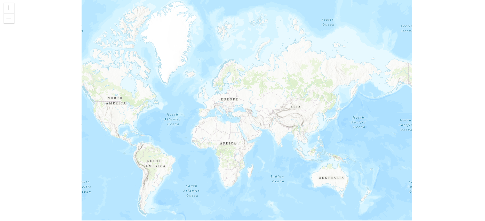
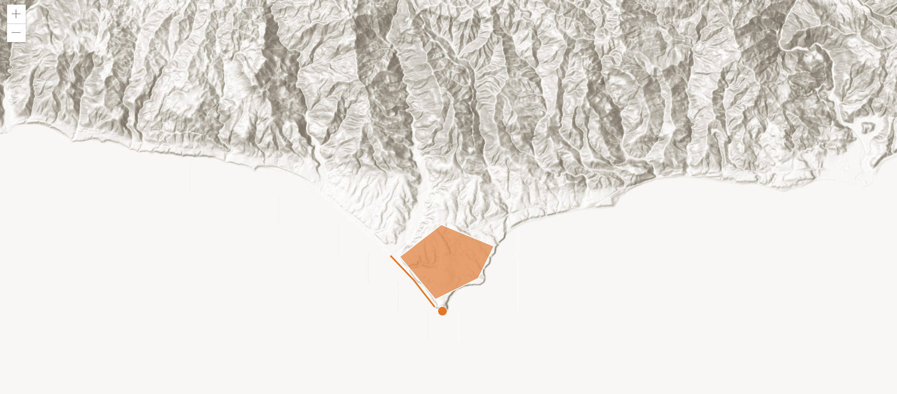

Gis-ArcGis简单加载地图信息 目录
[TOC]
***

# 前言

- `GIS`初识，使用`ArcGis`提供的接口，`ArcGIS API for JavaScript`
- 使用方法：
  - 引入`css, js`
  - 设置显示
  - `js`方法实现

# 推荐阅读

- [ArcGiS API for Js](https://developers.arcgis.com/javascript/latest/add-a-point-line-and-polygon/ "官方doc")

# 结果展示





# 代码

## `idnex.html`

```html
<!DOCTYPE html>
<html>
  <head>
    <meta charset="utf-8" />
    <meta name="viewport" content="initial-scale=1,maximum-scale=1,user-scalable=no" />
    <title>ArcGIS API for JavaScript 4.18</title>
    <style>
      html,
      body,
      #viewDiv {
        padding: 0;
        margin: 0;
        height: 100%;
        width: 100%;
      }
    </style>

    <link rel="stylesheet" href="https://js.arcgis.com/4.18/esri/themes/light/main.css" />
    <script src="https://js.arcgis.com/4.18/"></script>

    <script>
        // 这是使用的方法，先将你需要的模块导入，这里使用了Map和MapView。函数调用了导入模块的参数。
      require(["esri/Map", "esri/views/MapView"], function(Map, MapView) {
        //这里是新建一个地图，设置一些地图属性
        var map = new Map({
            //设置基地图，可以换，这是官方的地图，自己的项目，需要加载自己的地图服务。
          basemap: "topo-vector"
        });

         //新建视图，用的是MapView，是2D的，3D的要用SceneView模块，SceneView方法创建
        var view = new MapView({
          //显示在HTML上的区域，也就是哪个div里
          //将地图服务加载到视图上，这是4.x版本设定，3.x版本可直接创建map时设定，不需要view模块。
          container: "viewDiv",
          map: map,
          //设置加载地图的缩放等级和中心位置。
          zoom: 4,
          center: [15, 65] // longitude, latitude
        });
      });
    </script>
  </head>

  <body>
    <div id="viewDiv"></div>
  </body>
</html>

```

## `index2.html`

```js
<html>
    <html>
    <head>
      <meta charset="utf-8">
      <meta name="viewport" content="initial-scale=1, maximum-scale=1, user-scalable=no">
      <title>ArcGIS API for JavaScript Tutorials: Add a point, line, and polygon</title>
      <style>
        html, body, #viewDiv {
          padding: 0;
          margin: 0;
          height: 100%;
          width: 100%;
        }
      </style>
      <link rel="stylesheet" href="https://js.arcgis.com/4.18/esri/themes/light/main.css">
      <script src="https://js.arcgis.com/4.18/"></script>
      <script>
    
      require([
        "esri/config",
        "esri/Map",
        "esri/views/MapView",
    
        "esri/Graphic",
        "esri/layers/GraphicsLayer"
    
        ], function(esriConfig,Map, MapView, Graphic, GraphicsLayer) {
    
      esriConfig.apiKey = "YOUR-API-KEY";
    
      const map = new Map({
        basemap: "arcgis-topographic" //Basemap layer service
      });
    
      const view = new MapView({
        map: map,
        center: [-118.80500,34.02700], //Longitude, latitude
        zoom: 13,
        container: "viewDiv"
     });
    
     const graphicsLayer = new GraphicsLayer();
     map.add(graphicsLayer);
    
     const point = { //Create a point
        type: "point",
        longitude: -118.80657463861,
        latitude: 34.0005930608889
     };
     const simpleMarkerSymbol = {
        type: "simple-marker",
        color: [226, 119, 40],  // Orange
        outline: {
            color: [255, 255, 255], // White
            width: 1
        }
     };
    
     const pointGraphic = new Graphic({
        geometry: point,
        symbol: simpleMarkerSymbol
     });
     graphicsLayer.add(pointGraphic);
    
        // Create a line geometry
     const polyline = {
        type: "polyline",
        paths: [
            [-118.821527826096, 34.0139576938577], //Longitude, latitude
            [-118.814893761649, 34.0080602407843], //Longitude, latitude
            [-118.808878330345, 34.0016642996246]  //Longitude, latitude
        ]
     };
     const simpleLineSymbol = {
        type: "simple-line",
        color: [226, 119, 40], // Orange
        width: 2
     };
    
     const polylineGraphic = new Graphic({
        geometry: polyline,
        symbol: simpleLineSymbol
     });
     graphicsLayer.add(polylineGraphic);
    
     // Create a polygon geometry
     const polygon = {
        type: "polygon",
        rings: [
            [-118.818984489994, 34.0137559967283], //Longitude, latitude
            [-118.806796597377, 34.0215816298725], //Longitude, latitude
            [-118.791432890735, 34.0163883241613], //Longitude, latitude
            [-118.79596686535, 34.008564864635],   //Longitude, latitude
            [-118.808558110679, 34.0035027131376]  //Longitude, latitude
        ]
     };
    
     const simpleFillSymbol = {
        type: "simple-fill",
        color: [227, 139, 79, 0.8],  // Orange, opacity 80%
        outline: {
            color: [255, 255, 255],
            width: 1
        }
     };
    
     const popupTemplate = {
        title: "{Name}",
        content: "{Description}"
     }
     const attributes = {
        Name: "Graphic",
        Description: "I am a polygon"
     }
    
     const polygonGraphic = new Graphic({
        geometry: polygon,
        symbol: simpleFillSymbol,
    
        attributes: attributes,
        popupTemplate: popupTemplate
    
     });
     graphicsLayer.add(polygonGraphic);
    
     });
    </script>
    </head>
    <body>
      <div id="viewDiv"></div>
    </body>
    </html>
```

