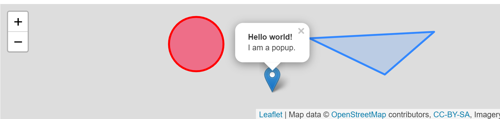

LeafletJS-初创简地图和冒泡提醒 目录
[TOC]
***

# 前言

- `Leaflet`学习笔记

# 推荐阅读

- [WebGIS教程 LeafletJS 初次使用LeafletJS](http://webgis.cn/leaflet-quickstart.html#_1)
- [Leafle](https://leafletjs.com/examples/quick-start/)

# 结果展示



# 代码例子

## `index.html`

```html
<!DOCTYPE html>
<html lang="en">
<head>
    <meta charset="UTF-8">
    <meta http-equiv="X-UA-Compatible" content="IE=edge">
    <meta name="viewport" content="width=device-width, initial-scale=1.0">
    <title>Document</title>
    <style>
        #mapid { height: 180px; }
    </style>
</head>
<body>
    <div id="mapid"></div>
</body>
<link rel="stylesheet" href="https://unpkg.com/leaflet@1.7.1/dist/leaflet.css"
integrity="sha512-xodZBNTC5n17Xt2atTPuE1HxjVMSvLVW9ocqUKLsCC5CXdbqCmblAshOMAS6/keqq/sMZMZ19scR4PsZChSR7A=="
crossorigin=""/>
<!-- 确保leaflet.js放在Leaflet's CSS之后 -->
 <!-- Make sure you put this AFTER Leaflet's CSS -->
 <script src="https://unpkg.com/leaflet@1.7.1/dist/leaflet.js"
   integrity="sha512-XQoYMqMTK8LvdxXYG3nZ448hOEQiglfqkJs1NOQV44cWnUrBc8PkAOcXy20w0vlaXaVUearIOBhiXZ5V3ynxwA=="
   crossorigin=""></script>
<script>
    

    var mymap = L.map('mapid').setView([51.505, -0.09], 13);

    L.tileLayer('https://api.tiles.mapbox.com/v4/{id}/{z}/{x}/{y}.png?access_token=pk.eyJ1IjoibWFwYm94IiwiYSI6ImNpejY4NXVycTA2emYycXBndHRqcmZ3N3gifQ.rJcFIG214AriISLbB6B5aw', {
        maxZoom: 18,
        attribution: 'Map data &copy; <a href="https://www.openstreetmap.org/">OpenStreetMap</a> contributors, ' +
            '<a href="https://creativecommons.org/licenses/by-sa/2.0/">CC-BY-SA</a>, ' +
            'Imagery ? <a href="https://www.mapbox.com/">Mapbox</a>',
        id: 'mapbox.streets'
    }).addTo(mymap);

    L.marker([51.5, -0.09]).addTo(mymap)
        .bindPopup("<b>Hello world!</b><br />I am a popup.").openPopup();

    L.circle([51.508, -0.11], 500, {
        color: 'red',
        fillColor: '#f03',
        fillOpacity: 0.5
    }).addTo(mymap).bindPopup("I am a circle.");

    L.polygon([
        [51.509, -0.08],
        [51.503, -0.06],
        [51.51, -0.047]
    ]).addTo(mymap).bindPopup("I am a polygon.");


    var popup = L.popup();

    function onMapClick(e) {
        popup
            .setLatLng(e.latlng)
            .setContent("You clicked the map at " + e.latlng.toString())
            .openOn(mymap);
    }

    mymap.on('click', onMapClick);


</script>
</html>
```

