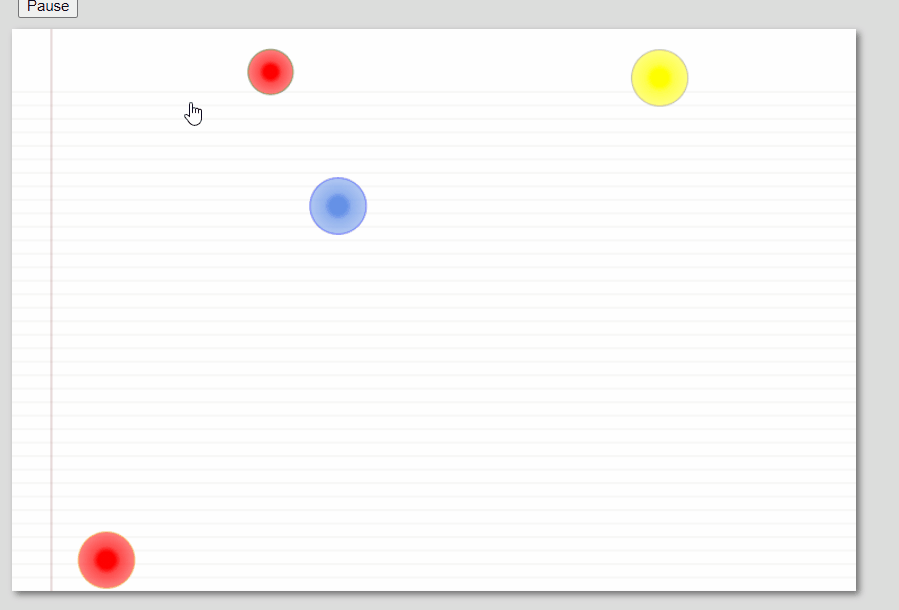

canvas-球体动画运动 目录
[TOC]
***

# 前言

- `Polyfill`多平台适用
- 边缘检测
- 球体运动

缺点：

- 如果每次都要重新绘图，图很复杂就会拖累性能

解决办法：

1. `clip()`每次只重绘剪辑出来的区域
2. 建立副屏`canvas`实现双缓冲机制

# 原版代码实现

## 效果展示



## `index.html`

```html
<!DOCTYPE html>
   <head>
     <title>Using requestAnimationFrame()</title>

      <style> 
         body {
            background: #dddddd;
         }

         #canvas {
            background: #ffffff;
            cursor: pointer;
            margin-left: 10px;
            margin-top: 10px;
            -webkit-box-shadow: 3px 3px 6px rgba(0,0,0,0.5);
            -moz-box-shadow: 3px 3px 6px rgba(0,0,0,0.5);
            box-shadow: 3px 3px 6px rgba(0,0,0,0.5);
         }

         #controls {
            margin-top: 10px;
            margin-left: 15px;
         }
      </style>
   </head>

   <body>
      <div id='controls'>
         <input id='animateButton' type='button' value='Animate'/>
      </div>

      <canvas id='canvas' width='750' height='500'>
         Canvas not supported
      </canvas>

      <script src='./requestNextAnimationFrame.js'></script>
      <script src='./main.js'></script>
   </body>
</html>

```

## `requestNextAnimationFrame.js`

```js
// requestNextAnimationFrame.js
window.requestNextAnimationFrame = (function() {
    let originalWebkitRequestAnimationFrame = undefined,
        wrapper = undefined,
        callback = undefined,
        geckoVersion = 0,
        userAgent = navigator.userAgent,
        index = 0;

    if(window.webkitRequestAnimationFrame) {
        wrapper = time => {
            if(time === undefined)  time = +new Date();
            this.callback(time);
        };

        originalWebkitRequestAnimationFrame = window.webkitRequestAnimationFrame;

        window.webkitRequestAnimationFrame = (callback, element) => {
            this.callback = callback;
            
            originalWebkitRequestAnimationFrame(wrapper, element);
        };
    }

    if(window.mozRequestAnimationFrame) {
        index = userAgent.indexOf('rv:');

        if(userAgent.indexOf('Gecko') !== -1){
            geckoVersion = userAgent.substr(index + 3, 3);

            if(geckoVersion === '2.0'){
                window.mozRequestAnimationFrame = undefined;
            }
        }
    }


    return window.requestAnimationFrame   ||
        window.webkitRequestAnimationFrame ||
        window.mozRequestAnimationFrame   ||
        window.oRequestAnimationFrame     ||
        window.msRequestAnimationFrame    ||

        function(callback, element) {
            let start,
                finish;

            window.setTimeout(function() {
                start = +new Date();
                callback(start);
                finish = +new Date();

                this.timeout = 1000 / 60 - (finish - start);
            }, this.timeout);
        };
})();
```

## `main.js`

```js
const discs = [
    {
        x: 150,
        y: 250,
        lastX: 150,
        lastY: 250,
        velocityX: -3.2,
        velocityY: 3.5,
        radius: 25,
        innerColor: 'rgba(255, 255, 0, 1)',
        middleColor: 'rgba(255, 255, 0, 0.7)',
        outerColor: 'rgba(255, 255, 0, 0.5)',
        strokeStyle: 'gray'
    },

    {
        x: 50,
        y: 150,
        lastX: 50,
        lastY: 150,
        velocityX: 2.2,
        velocityY: 2.5,
        radius: 25,
        innerColor: 'rgba(100, 145, 230, 1.0)',
        middleColor: 'rgba(100, 145, 230, 0.7)',
        outerColor: 'rgba(100, 145, 230, 0.5)',
        strokeStyle: 'blue'
    },

    {
        x: 150,
        y: 75,
        lastX: 150,
        lastY: 75,
        velocityX: 1.2,
        velocityY: 1.5,
        radius: 25,
        innerColor: 'rgba(255, 0, 0, 1.0)',
        middleColor: 'rgba(255, 0, 0, 0.7)',
        outerColor: 'rgba(255, 0, 0, 0.5)',
        strokeStyle: 'orange'
    },

    {
        x: 150,
        y: 75,
        lastX: 150,
        lastY: 75,
        velocityX: 1.4,
        velocityY: 1.6,
        radius: 20,
        innerColor: 'rgba(255, 0, 0, 1.0)',
        middleColor: 'rgba(255, 0, 0, 0.7)',
        outerColor: 'rgba(255, 0, 0, 0.5)',
        strokeStyle: 'green'
    }
];

let canvas = document.getElementById('canvas'),
    context = canvas.getContext('2d'),
    paused = true,
    animateButton = document.getElementById('animateButton'),
    numDiscs = discs.length;

// Functions
// 绘制背景线
function drawBackground() {
    let STEP_Y =12,
        i = context.canvas.height;

    context.strokeStyle = 'lightgray';
    context.lineWidth = 0.5;

    // 绘制横线
    while(i > STEP_Y * 4) {
        context.beginPath();
        
        context.moveTo(0, i);
        context.lineTo(context.canvas.width, i);
        
        context.stroke();

        i -= STEP_Y;
    }

    context.save();

    context.strokeStyle = 'rgba(100,0,0,0.3)';
    context.lineWidth = 1;
    
    context.beginPath();
    context.moveTo(35,0);
    context.lineTo(35, context.canvas.height);
    context.stroke();

    context.restore();
}

// 运动和边界检测
function update(){
    let disc = null;

    for(let i of discs){
        disc = i;
        // 边缘检测
        // 横向边界定位
        if(disc.x + disc.velocityX + disc.radius > context.canvas.width ||
            disc.x + disc.velocityX - disc.radius < 0){
                disc.velocityX = -disc.velocityX;
            }
        // 纵向边界定位
        if(disc.y + disc.velocityY + disc.radius > context.canvas.height ||
            disc.y + disc.velocityY - disc.radius < 0){
                disc.velocityY = -disc.velocityY;
            }
        // 运动
        disc.x += disc.velocityX;
        disc.y += disc.velocityY;
    }
}

//绘制渐变色的圆
function draw() {
    let disc = null;

    for(let i of discs) {
        disc = i;

        let gradient = context.createRadialGradient(disc.x, disc.y, 0, disc.x, disc.y, disc.radius);

        gradient.addColorStop(0.3, disc.innerColor);
        gradient.addColorStop(0.5, disc.middleColor);
        gradient.addColorStop(1.0, disc.outerColor);

        context.save();

        context.beginPath();
        
        context.arc(disc.x,disc.y,disc.radius,0,Math.PI*2,false);
        context.clip();

        context.fillStyle = gradient;
        context.strokeStyle = disc.strokeStyle;

        context.fill();
        context.stroke();

        context.restore();
    }
}

// 动画
function animate(time) {
    if(!paused){
        context.clearRect(0,0,canvas.width,canvas.height);

        drawBackground();
        update();
        draw();

        window.requestNextAnimationFrame(arguments.callee);
    }
}

// main入口
context.font = '48px Helvetica';

animateButton.onclick = event => {
    paused = paused ? false : true;

    if(paused) {
        animateButton.value = 'Animate';
    } else {
        window.requestNextAnimationFrame(animate);

        animateButton.value = 'Pause';
    }
};
```

# 基于时间的运动

## 效果


## `index.html`

```html
<!DOCTYPE html>
   <head>
     <title>Time-based Motion</title>

      <style> 
         body {
            background: #dddddd;
            width: 770px;
         }

         .canvas {
            background: #ffffff;
            -webkit-box-shadow: rgba(0,0,0,0.5) 5px 5px 20px;
            -moz-box-shadow: rgba(0,0,0,0.5) 5px 5px 20px;
            box-shadow: rgba(0,0,0,0.5) 5px 5px 20px;
            margin-bottom: 10px;
         }
         
         #canvas {
            position: absolute;
            left: 0px;
            top: 20px;
            margin: 20px;
            border: thin inset rgba(100,150,230,0.5);
         }

         .floatingControls {
            font-family: Droid Sans, Arial, Helvetica, sans-serif;
            font-size: 12px;
            color: slateblue;
            padding: 10px;
            margin: 10px;
            width: 12em;
            background: rgba(255, 255, 255, 0.3);
            border: thin solid rgba(0, 0, 0, 0.6);
            -webkit-box-shadow: rgba(0,0,0,0.5) 5px 5px 20px;
            -moz-box-shadow: rgba(0,0,0,0.5) 5px 5px 20px;
            box-shadow: rgba(0,0,0,0.5) 5px 5px 20px;
            -webkit-border-radius: 10px;
            -moz-border-radius: 10px;
            border-radius: 10px;
         }
         
         #controls {
            margin-top: 10px;
            margin-left: 15px;
         }
      </style>
   </head>

  <body>
    <div id='controls'>
      <div class='floatingControls' id='timeBasedMotionControls'>
         <input type='checkbox' id='timeBasedMotionCheckbox'/>Time-based Motion&nbsp;
      </div>

      <input type='button' id='topAnimateButton' value='Animate'
                  style='font-size: 0.75em; position: absolute; left: 670px; top: 70px; z-index: 2;'/>
            
      <input type='button' id='bottomAnimateButton' value='Animate'
                  style='font-size: 0.75em; position: absolute; left: 670px; top: 380px; z-index: 2;'/>
    </div>

    <canvas id='topCanvas' class='canvas' width='750' height='300'>
      Canvas not supported
    </canvas>

    <canvas id='bottomCanvas' class='canvas' width='750' height='300'>
      Canvas not supported
    </canvas>

    <script src='top.js'></script>
    <script src='bottom.js'></script>
  </body>
</html>

```

## `top.js`

```js
var COREHTML5 = COREHTML5 || {};

COREHTML5.topLeftTimeBasedMotion = function () {
    var topCanvas = document.querySelector('#topCanvas'),
        topContext = topCanvas.getContext('2d'),
        paused = true,
        discs = [
        { 
            x: 150,
            y: 250,
            lastX: 150,
            lastY: 250,
            velocityX: -3.2,
            velocityY: 3.5,
            radius: 25,
            innerColor: 'rgba(255,255,0,1)',
            middleColor: 'rgba(255,255,0,0.7)',
            outerColor: 'rgba(255,255,0,0.5)',
            shadowColor: 'rgba(175,175,175,0.7)',
            strokeStyle: 'gray',
        },

        { 
            x: 50,
            y: 150,
            lastX: 50,
            lastY: 150,
            velocityX: 2.2,
            velocityY: 2.5,
            radius: 25,
            innerColor: 'rgba(100,145,230,1.0)',
            middleColor: 'rgba(100,145,230,0.7)',
            outerColor: 'rgba(100,145,230,0.5)',
            shadowColor: 'rgba(100,145,230,0.8)',
            strokeStyle: 'blue'
        },

        { 
            x: 150,
            y: 75,
            lastX: 150,
            lastY: 75,
            velocityX: 1.2,
            velocityY: 1.5,
            radius: 25,
            innerColor: 'rgba(255,0,0,1.0)',
            middleColor: 'rgba(255,0,0,0.7)',
            outerColor: 'rgba(255,0,0,0.5)',
            shadowColor: 'rgba(255,0,0,0.7)',
            strokeStyle: 'orange'
        },
        { 
            x: 50,
            y: 150,
            lastX: 150,
            lastY: 250,
            velocityX: -3.2,
            velocityY: -3.5,
            radius: 25,
            innerColor: 'rgba(255,255,0,1)',
            middleColor: 'rgba(255,255,0,0.7)',
            outerColor: 'rgba(255,255,0,0.5)',
            shadowColor: 'rgba(175,175,175,0.7)',
            strokeStyle: 'gray',
        },

        { 
            x: 50,
            y: 75,
            lastX: 50,
            lastY: 150,
            velocityX: 2.2,
            velocityY: -2.5,
            radius: 25,
            innerColor: 'rgba(100,145,230,1.0)',
            middleColor: 'rgba(100,145,230,0.7)',
            outerColor: 'rgba(100,145,230,0.5)',
            shadowColor: 'rgba(100,145,230,0.8)',
            strokeStyle: 'blue'
        },

        { 
            x: 200,
            y: 175,
            lastX: 150,
            lastY: 75,
            velocityX: -1.9,
            velocityY: 1.2,
            radius: 25,
            innerColor: 'rgba(255,0,0,1.0)',
            middleColor: 'rgba(255,0,0,0.7)',
            outerColor: 'rgba(255,0,0,0.5)',
            shadowColor: 'rgba(255,0,0,0.7)',
            strokeStyle: 'orange'
        },
        { 
            x: 250,
            y: 250,
            lastX: 150,
            lastY: 250,
            velocityX: 5.2,
            velocityY: -3.5,
            radius: 25,
            innerColor: 'rgba(255,255,0,1)',
            middleColor: 'rgba(255,255,0,0.7)',
            outerColor: 'rgba(255,255,0,0.5)',
            shadowColor: 'rgba(175,175,175,0.7)',
            strokeStyle: 'gray',
        },

        { 
            x: 150,
            y: 100,
            lastX: 50,
            lastY: 150,
            velocityX: -2.9,
            velocityY: -1.5,
            radius: 25,
            innerColor: 'rgba(100,145,230,1.0)',
            middleColor: 'rgba(100,145,230,0.7)',
            outerColor: 'rgba(100,145,230,0.5)',
            shadowColor: 'rgba(100,145,230,0.8)',
            strokeStyle: 'blue'
        },

        { 
            x: 215,
            y: 175,
            lastX: 150,
            lastY: 75,
            velocityX: -2.2,
            velocityY: 2.5,
            radius: 25,
            innerColor: 'rgba(255,0,0,1.0)',
            middleColor: 'rgba(255,0,0,0.7)',
            outerColor: 'rgba(255,0,0,0.5)',
            shadowColor: 'rgba(255,0,0,0.7)',
            strokeStyle: 'orange'
        },
        { 
            x: 250,
            y: 150,
            lastX: 150,
            lastY: 250,
            velocityX: 4.2,
            velocityY: -5.5,
            radius: 25,
            innerColor: 'rgba(255,255,0,1)',
            middleColor: 'rgba(255,255,0,0.7)',
            outerColor: 'rgba(255,255,0,0.5)',
            shadowColor: 'rgba(175,175,175,0.7)',
            strokeStyle: 'gray',
        },

        { 
            x: 150,
            y: 75,
            lastX: 50,
            lastY: 150,
            velocityX: 3.2,
            velocityY: -3.5,
            radius: 25,
            innerColor: 'rgba(100,145,230,1.0)',
            middleColor: 'rgba(100,145,230,0.7)',
            outerColor: 'rgba(100,145,230,0.5)',
            shadowColor: 'rgba(100,145,230,0.8)',
            strokeStyle: 'blue'
        },

        { 
            x: 100,
            y: 100,
            lastX: 150,
            lastY: 75,
            velocityX: -2.9,
            velocityY: -2.2,
            radius: 25,
            innerColor: 'rgba(255,0,0,1.0)',
            middleColor: 'rgba(255,0,0,0.7)',
            outerColor: 'rgba(255,0,0,0.5)',
            shadowColor: 'rgba(255,0,0,0.7)',
            strokeStyle: 'orange'
        },
        { 
            x: 150,
            y: 250,
            lastX: 150,
            lastY: 250,
            velocityX: -5.2,
            velocityY: 5.5,
            radius: 25,
            innerColor: 'rgba(255,255,0,1)',
            middleColor: 'rgba(255,255,0,0.7)',
            outerColor: 'rgba(255,255,0,0.5)',
            shadowColor: 'rgba(175,175,175,0.7)',
            strokeStyle: 'gray',
        },

        { 
            x: 50,
            y: 150,
            lastX: 50,
            lastY: 150,
            velocityX: 4.2,
            velocityY: 4.5,
            radius: 25,
            innerColor: 'rgba(100,145,230,1.0)',
            middleColor: 'rgba(100,145,230,0.7)',
            outerColor: 'rgba(100,145,230,0.5)',
            shadowColor: 'rgba(100,145,230,0.8)',
            strokeStyle: 'blue'
        },

        { 
            x: 150,
            y: 75,
            lastX: 150,
            lastY: 75,
            velocityX: 2.2,
            velocityY: 2.5,
            radius: 25,
            innerColor: 'rgba(255,0,0,1.0)',
            middleColor: 'rgba(255,0,0,0.7)',
            outerColor: 'rgba(255,0,0,0.5)',
            shadowColor: 'rgba(255,0,0,0.7)',
            strokeStyle: 'orange'
        },
        { 
            x: 50,
            y: 150,
            lastX: 150,
            lastY: 250,
            velocityX: -0.2,
            velocityY: -1.5,
            radius: 25,
            innerColor: 'rgba(255,255,0,1)',
            middleColor: 'rgba(255,255,0,0.7)',
            outerColor: 'rgba(255,255,0,0.5)',
            shadowColor: 'rgba(175,175,175,0.7)',
            strokeStyle: 'gray',
        },

        { 
            x: 50,
            y: 75,
            lastX: 50,
            lastY: 150,
            velocityX: 1.2,
            velocityY: -2.5,
            radius: 25,
            innerColor: 'rgba(100,145,230,1.0)',
            middleColor: 'rgba(100,145,230,0.7)',
            outerColor: 'rgba(100,145,230,0.5)',
            shadowColor: 'rgba(100,145,230,0.8)',
            strokeStyle: 'blue'
        },

        { 
            x: 200,
            y: 175,
            lastX: 150,
            lastY: 75,
            velocityX: 1.9,
            velocityY: -1.2,
            radius: 25,
            innerColor: 'rgba(255,0,0,1.0)',
            middleColor: 'rgba(255,0,0,0.7)',
            outerColor: 'rgba(255,0,0,0.5)',
            shadowColor: 'rgba(255,0,0,0.7)',
            strokeStyle: 'orange'
        },
        { 
            x: 250,
            y: 250,
            lastX: 150,
            lastY: 250,
            velocityX: 3.2,
            velocityY: -5.5,
            radius: 25,
            innerColor: 'rgba(255,255,0,1)',
            middleColor: 'rgba(255,255,0,0.7)',
            outerColor: 'rgba(255,255,0,0.5)',
            shadowColor: 'rgba(175,175,175,0.7)',
            strokeStyle: 'gray',
        },

        { 
            x: 150,
            y: 100,
            lastX: 50,
            lastY: 150,
            velocityX: -1.9,
            velocityY: -2.5,
            radius: 25,
            innerColor: 'rgba(100,145,230,1.0)',
            middleColor: 'rgba(100,145,230,0.7)',
            outerColor: 'rgba(100,145,230,0.5)',
            shadowColor: 'rgba(100,145,230,0.8)',
            strokeStyle: 'blue'
        },

        { 
            x: 215,
            y: 175,
            lastX: 150,
            lastY: 75,
            velocityX: -3.2,
            velocityY: 4.5,
            radius: 25,
            innerColor: 'rgba(255,0,0,1.0)',
            middleColor: 'rgba(255,0,0,0.7)',
            outerColor: 'rgba(255,0,0,0.5)',
            shadowColor: 'rgba(255,0,0,0.7)',
            strokeStyle: 'orange'
        },
        { 
            x: 250,
            y: 150,
            lastX: 150,
            lastY: 250,
            velocityX: 2.2,
            velocityY: -4.5,
            radius: 25,
            innerColor: 'rgba(255,255,0,1)',
            middleColor: 'rgba(255,255,0,0.7)',
            outerColor: 'rgba(255,255,0,0.5)',
            shadowColor: 'rgba(175,175,175,0.7)',
            strokeStyle: 'gray',
        },

        { 
            x: 150,
            y: 75,
            lastX: 50,
            lastY: 150,
            velocityX: 2.2,
            velocityY: -1.5,
            radius: 25,
            innerColor: 'rgba(100,145,230,1.0)',
            middleColor: 'rgba(100,145,230,0.7)',
            outerColor: 'rgba(100,145,230,0.5)',
            shadowColor: 'rgba(100,145,230,0.8)',
            strokeStyle: 'blue'
        },

        { 
            x: 100,
            y: 100,
            lastX: 150,
            lastY: 75,
            velocityX: -5.9,
            velocityY: -0.2,
            radius: 25,
            innerColor: 'rgba(255,0,0,1.0)',
            middleColor: 'rgba(255,0,0,0.7)',
            outerColor: 'rgba(255,0,0,0.5)',
            shadowColor: 'rgba(255,0,0,0.7)',
            strokeStyle: 'orange'
        },
    ],
    numDiscs = discs.length,
    startTime = 0,
    lastTime = 0,
    elapsedTime = 0,
    fps = 0,
    lastFpsUpdate = { time: 0, value: 0 },
    animateButton = document.querySelector('#topAnimateButton'),
    timeBasedMotionCheckbox = document.querySelector('#timeBasedMotionCheckbox'),
    timeBasedMotion = timeBasedMotionCheckbox.checked;

    function eraseBackground() {
    topContext.clearRect(0,0,topCanvas.width,topCanvas.height);
    }

    function drawBackground() {
    var STEP_Y = 12,
        i = topContext.canvas.height;
    
    topContext.strokeStyle = 'lightgray';
    topContext.lineWidth = 0.5;

    topContext.save();
    topContext.restore();

    while(i > STEP_Y*4) {
        topContext.beginPath();
        topContext.moveTo(0, i);
        topContext.lineTo(topContext.canvas.width, i);
        topContext.stroke();
        i -= STEP_Y;
    }

    topContext.save();

    topContext.strokeStyle = 'rgba(100,0,0,0.3)';
    topContext.lineWidth = 1;

    topContext.beginPath();

    topContext.moveTo(35,0);
    topContext.lineTo(35,topContext.canvas.height);
    topContext.stroke();

    topContext.restore();
    }

    function update() {
    var i = numDiscs,
        disc = null;

    while(i--) {
        disc = discs[i];

        if (disc.x + disc.velocityX + disc.radius > topContext.canvas.width ||
            disc.x + disc.velocityX - disc.radius < 0) 
            disc.velocityX = -disc.velocityX;

        if (disc.y + disc.velocityY + disc.radius > topContext.canvas.height ||
            disc.y + disc.velocityY - disc.radius  < 0) 
            disc.velocityY= -disc.velocityY;

        disc.x += disc.velocityX;
        disc.y += disc.velocityY;
    }
    }

    function updateTimeBased(time) {
    var i = numDiscs,
        disc = null;

    if (fps == 0)
        return;
    
    while(i--) {
        disc = discs[i];
        deltaX = disc.velocityX 

        deltaX = disc.velocityX * (elapsedTime / 1000);
        deltaY = disc.velocityY * (elapsedTime / 1000);

        if (disc.x + deltaX + disc.radius > topContext.canvas.width ||
            disc.x + deltaX - disc.radius < 0) {
            disc.velocityX = -disc.velocityX;
            deltaX = -deltaX;
        }

        if (disc.y + deltaY + disc.radius > topContext.canvas.height ||
            disc.y + deltaY - disc.radius < 0) {
            disc.velocityY= -disc.velocityY;
            deltaY = -deltaY;
        }

        disc.x = disc.x + deltaX;
        disc.y = disc.y + deltaY;
    }
    }

    function draw() {
    var i = numDiscs,
        disc = discs[i];

    while(i--) {
        disc = discs[i];

        gradient = topContext.createRadialGradient(disc.x, disc.y, 0,
                            disc.x, disc.y, disc.radius);

        gradient.addColorStop(0.3, disc.innerColor);
        gradient.addColorStop(0.5, disc.middleColor);
        gradient.addColorStop(1.0, disc.outerColor);

        topContext.beginPath();
        topContext.arc(disc.x, disc.y, disc.radius, 0, Math.PI*2, false);

        topContext.save();

        topContext.fillStyle = gradient;
        topContext.strokeStyle = disc.strokeStyle;
        topContext.fill();
        topContext.stroke();
        topContext.restore();
    }
    }

    function calculateFps(now) {
    elapsedTime = now - lastTime;
    fps = 1000 / elapsedTime;
    lastTime = now;
    }

    function updateFps() {
    var now = (+new Date);

    calculateFps(now);
    
    if (now - startTime < 2000) {
        return;
    }

    if (now - lastFpsUpdate.time > 1000) {
        lastFpsUpdate.time = now;
        lastFpsUpdate.value = fps;
    }
    if (!paused) {
        topContext.fillStyle = 'cornflowerblue';
        topContext.fillText(lastFpsUpdate.value.toFixed() + ' fps', 50, 48);
    }
    }

    function animateTopLeft(time) {
    if (time === undefined) {
        time = +new Date;
    }

    if (!paused) {
        eraseBackground();
        drawBackground();
        if (timeBasedMotion) {
            updateTimeBased(time);
        }
        else {
            update();
        }
        draw();
    }

    updateFps();
    }

    animateButton.addEventListener('click', function (e) {
    paused = paused ? false : true;
    if (paused) {
        animateButton.value = 'Animate';
    }
    else {
        animateButton.value = 'Pause';
    }
    });

    timeBasedMotionCheckbox.addEventListener('click', function (e) {
    if (timeBasedMotionCheckbox.checked) {
        timeBasedMotion = true;
        for (var i=0; i < discs.length; ++i) {
            discs[i].velocityX *= 50;
            discs[i].velocityY *= 50;
        }
    }
    else {
        timeBasedMotion = false;
        for (var i=0; i < discs.length; ++i) {
            discs[i].velocityX /= 50;
            discs[i].velocityY /= 50;
        }
    }
    });

    topContext.font = '36px Helvetica';
    drawBackground();
    startTime = +new Date;
    setInterval(animateTopLeft, 1000/60);
}();

```

## `bottom.js`

```js
var COREHTML5 = COREHTML5 || {};

COREHTML5.bottomRightTimeBasedMotion = function () {
    var canvas = document.querySelector('#bottomCanvas'),
        context = canvas.getContext('2d'),
        paused = true,
        discs = [
        { 
            x: 150,
            y: 250,
            lastX: 150,
            lastY: 250,
            velocityX: -3.2,
            velocityY: 3.5,
            radius: 25,
            innerColor: 'rgba(255,255,0,1)',
            middleColor: 'rgba(255,255,0,0.7)',
            outerColor: 'rgba(255,255,0,0.5)',
            shadowColor: 'rgba(175,175,175,0.7)',
            strokeStyle: 'gray',
        },

        { 
            x: 50,
            y: 150,
            lastX: 50,
            lastY: 150,
            velocityX: 2.2,
            velocityY: 2.5,
            radius: 25,
            innerColor: 'rgba(100,145,230,1.0)',
            middleColor: 'rgba(100,145,230,0.7)',
            outerColor: 'rgba(100,145,230,0.5)',
            shadowColor: 'rgba(100,145,230,0.8)',
            strokeStyle: 'blue'
        },

        { 
            x: 150,
            y: 75,
            lastX: 150,
            lastY: 75,
            velocityX: 1.2,
            velocityY: 1.5,
            radius: 25,
            innerColor: 'rgba(255,0,0,1.0)',
            middleColor: 'rgba(255,0,0,0.7)',
            outerColor: 'rgba(255,0,0,0.5)',
            shadowColor: 'rgba(255,0,0,0.7)',
            strokeStyle: 'orange'
        },
        { 
            x: 50,
            y: 150,
            lastX: 150,
            lastY: 250,
            velocityX: -3.2,
            velocityY: -3.5,
            radius: 25,
            innerColor: 'rgba(255,255,0,1)',
            middleColor: 'rgba(255,255,0,0.7)',
            outerColor: 'rgba(255,255,0,0.5)',
            shadowColor: 'rgba(175,175,175,0.7)',
            strokeStyle: 'gray',
        },

        { 
            x: 50,
            y: 75,
            lastX: 50,
            lastY: 150,
            velocityX: 2.2,
            velocityY: -2.5,
            radius: 25,
            innerColor: 'rgba(100,145,230,1.0)',
            middleColor: 'rgba(100,145,230,0.7)',
            outerColor: 'rgba(100,145,230,0.5)',
            shadowColor: 'rgba(100,145,230,0.8)',
            strokeStyle: 'blue'
        },

        { 
            x: 200,
            y: 175,
            lastX: 150,
            lastY: 75,
            velocityX: -1.9,
            velocityY: 1.2,
            radius: 25,
            innerColor: 'rgba(255,0,0,1.0)',
            middleColor: 'rgba(255,0,0,0.7)',
            outerColor: 'rgba(255,0,0,0.5)',
            shadowColor: 'rgba(255,0,0,0.7)',
            strokeStyle: 'orange'
        },
        { 
            x: 250,
            y: 250,
            lastX: 150,
            lastY: 250,
            velocityX: 5.2,
            velocityY: -3.5,
            radius: 25,
            innerColor: 'rgba(255,255,0,1)',
            middleColor: 'rgba(255,255,0,0.7)',
            outerColor: 'rgba(255,255,0,0.5)',
            shadowColor: 'rgba(175,175,175,0.7)',
            strokeStyle: 'gray',
        },

        { 
            x: 150,
            y: 100,
            lastX: 50,
            lastY: 150,
            velocityX: -2.9,
            velocityY: -1.5,
            radius: 25,
            innerColor: 'rgba(100,145,230,1.0)',
            middleColor: 'rgba(100,145,230,0.7)',
            outerColor: 'rgba(100,145,230,0.5)',
            shadowColor: 'rgba(100,145,230,0.8)',
            strokeStyle: 'blue'
        },

        { 
            x: 215,
            y: 175,
            lastX: 150,
            lastY: 75,
            velocityX: -2.2,
            velocityY: 2.5,
            radius: 25,
            innerColor: 'rgba(255,0,0,1.0)',
            middleColor: 'rgba(255,0,0,0.7)',
            outerColor: 'rgba(255,0,0,0.5)',
            shadowColor: 'rgba(255,0,0,0.7)',
            strokeStyle: 'orange'
        },
        { 
            x: 250,
            y: 150,
            lastX: 150,
            lastY: 250,
            velocityX: 4.2,
            velocityY: -5.5,
            radius: 25,
            innerColor: 'rgba(255,255,0,1)',
            middleColor: 'rgba(255,255,0,0.7)',
            outerColor: 'rgba(255,255,0,0.5)',
            shadowColor: 'rgba(175,175,175,0.7)',
            strokeStyle: 'gray',
        },

        { 
            x: 150,
            y: 75,
            lastX: 50,
            lastY: 150,
            velocityX: 3.2,
            velocityY: -3.5,
            radius: 25,
            innerColor: 'rgba(100,145,230,1.0)',
            middleColor: 'rgba(100,145,230,0.7)',
            outerColor: 'rgba(100,145,230,0.5)',
            shadowColor: 'rgba(100,145,230,0.8)',
            strokeStyle: 'blue'
        },

        { 
            x: 100,
            y: 100,
            lastX: 150,
            lastY: 75,
            velocityX: -2.9,
            velocityY: -2.2,
            radius: 25,
            innerColor: 'rgba(255,0,0,1.0)',
            middleColor: 'rgba(255,0,0,0.7)',
            outerColor: 'rgba(255,0,0,0.5)',
            shadowColor: 'rgba(255,0,0,0.7)',
            strokeStyle: 'orange'
        },
        { 
            x: 150,
            y: 250,
            lastX: 150,
            lastY: 250,
            velocityX: -5.2,
            velocityY: 5.5,
            radius: 25,
            innerColor: 'rgba(255,255,0,1)',
            middleColor: 'rgba(255,255,0,0.7)',
            outerColor: 'rgba(255,255,0,0.5)',
            shadowColor: 'rgba(175,175,175,0.7)',
            strokeStyle: 'gray',
        },

        { 
            x: 50,
            y: 150,
            lastX: 50,
            lastY: 150,
            velocityX: 4.2,
            velocityY: 4.5,
            radius: 25,
            innerColor: 'rgba(100,145,230,1.0)',
            middleColor: 'rgba(100,145,230,0.7)',
            outerColor: 'rgba(100,145,230,0.5)',
            shadowColor: 'rgba(100,145,230,0.8)',
            strokeStyle: 'blue'
        },

        { 
            x: 150,
            y: 75,
            lastX: 150,
            lastY: 75,
            velocityX: 2.2,
            velocityY: 2.5,
            radius: 25,
            innerColor: 'rgba(255,0,0,1.0)',
            middleColor: 'rgba(255,0,0,0.7)',
            outerColor: 'rgba(255,0,0,0.5)',
            shadowColor: 'rgba(255,0,0,0.7)',
            strokeStyle: 'orange'
        },
        { 
            x: 50,
            y: 150,
            lastX: 150,
            lastY: 250,
            velocityX: -0.2,
            velocityY: -1.5,
            radius: 25,
            innerColor: 'rgba(255,255,0,1)',
            middleColor: 'rgba(255,255,0,0.7)',
            outerColor: 'rgba(255,255,0,0.5)',
            shadowColor: 'rgba(175,175,175,0.7)',
            strokeStyle: 'gray',
        },

        { 
            x: 50,
            y: 75,
            lastX: 50,
            lastY: 150,
            velocityX: 1.2,
            velocityY: -2.5,
            radius: 25,
            innerColor: 'rgba(100,145,230,1.0)',
            middleColor: 'rgba(100,145,230,0.7)',
            outerColor: 'rgba(100,145,230,0.5)',
            shadowColor: 'rgba(100,145,230,0.8)',
            strokeStyle: 'blue'
        },

        { 
            x: 200,
            y: 175,
            lastX: 150,
            lastY: 75,
            velocityX: 1.9,
            velocityY: -1.2,
            radius: 25,
            innerColor: 'rgba(255,0,0,1.0)',
            middleColor: 'rgba(255,0,0,0.7)',
            outerColor: 'rgba(255,0,0,0.5)',
            shadowColor: 'rgba(255,0,0,0.7)',
            strokeStyle: 'orange'
        },
        { 
            x: 250,
            y: 250,
            lastX: 150,
            lastY: 250,
            velocityX: 3.2,
            velocityY: -5.5,
            radius: 25,
            innerColor: 'rgba(255,255,0,1)',
            middleColor: 'rgba(255,255,0,0.7)',
            outerColor: 'rgba(255,255,0,0.5)',
            shadowColor: 'rgba(175,175,175,0.7)',
            strokeStyle: 'gray',
        },

        { 
            x: 150,
            y: 100,
            lastX: 50,
            lastY: 150,
            velocityX: -1.9,
            velocityY: -2.5,
            radius: 25,
            innerColor: 'rgba(100,145,230,1.0)',
            middleColor: 'rgba(100,145,230,0.7)',
            outerColor: 'rgba(100,145,230,0.5)',
            shadowColor: 'rgba(100,145,230,0.8)',
            strokeStyle: 'blue'
        },

        { 
            x: 215,
            y: 175,
            lastX: 150,
            lastY: 75,
            velocityX: -3.2,
            velocityY: 4.5,
            radius: 25,
            innerColor: 'rgba(255,0,0,1.0)',
            middleColor: 'rgba(255,0,0,0.7)',
            outerColor: 'rgba(255,0,0,0.5)',
            shadowColor: 'rgba(255,0,0,0.7)',
            strokeStyle: 'orange'
        },
        { 
            x: 250,
            y: 150,
            lastX: 150,
            lastY: 250,
            velocityX: 2.2,
            velocityY: -4.5,
            radius: 25,
            innerColor: 'rgba(255,255,0,1)',
            middleColor: 'rgba(255,255,0,0.7)',
            outerColor: 'rgba(255,255,0,0.5)',
            shadowColor: 'rgba(175,175,175,0.7)',
            strokeStyle: 'gray',
        },

        { 
            x: 150,
            y: 75,
            lastX: 50,
            lastY: 150,
            velocityX: 2.2,
            velocityY: -1.5,
            radius: 25,
            innerColor: 'rgba(100,145,230,1.0)',
            middleColor: 'rgba(100,145,230,0.7)',
            outerColor: 'rgba(100,145,230,0.5)',
            shadowColor: 'rgba(100,145,230,0.8)',
            strokeStyle: 'blue'
        },

        { 
            x: 100,
            y: 100,
            lastX: 150,
            lastY: 75,
            velocityX: -5.9,
            velocityY: -0.2,
            radius: 25,
            innerColor: 'rgba(255,0,0,1.0)',
            middleColor: 'rgba(255,0,0,0.7)',
            outerColor: 'rgba(255,0,0,0.5)',
            shadowColor: 'rgba(255,0,0,0.7)',
            strokeStyle: 'orange'
        },
    ],
    numDiscs = discs.length,
    startTime = 0,
    lastTime = 0,
    fps = 0,
    lastFpsUpdate = { time: 0, value: 0 },
    animateButton = document.querySelector('#bottomAnimateButton'),
    timeBasedMotionCheckbox = document.querySelector('#timeBasedMotionCheckbox'),
    timeBasedMotion = timeBasedMotionCheckbox.checked;

    function eraseBackground() {
    context.clearRect(0,0,canvas.width,canvas.height);
    }

    function drawBackground() {
    var STEP_Y = 12,
        i = context.canvas.height;
    
    context.strokeStyle = 'lightgray';
    context.lineWidth = 0.5;

    context.save();
    context.restore();

    while(i > STEP_Y*4) {
        context.beginPath();
        context.moveTo(0, i);
        context.lineTo(context.canvas.width, i);
        context.stroke();
        i -= STEP_Y;
    }

    context.save();

    context.strokeStyle = 'rgba(100,0,0,0.3)';
    context.lineWidth = 1;

    context.beginPath();

    context.moveTo(35,0);
    context.lineTo(35,context.canvas.height);
    context.stroke();

    context.restore();
    }

    function update() {
    var i = numDiscs,
        disc = null;

    while(i--) {
        disc = discs[i];

        if (disc.x + disc.velocityX + disc.radius > context.canvas.width ||
            disc.x + disc.velocityX - disc.radius < 0) 
            disc.velocityX = -disc.velocityX;

        if (disc.y + disc.velocityY + disc.radius > context.canvas.height ||
            disc.y + disc.velocityY - disc.radius  < 0) 
            disc.velocityY= -disc.velocityY;

        disc.x += disc.velocityX;
        disc.y += disc.velocityY;
    }
    }

    function updateTimeBased(time) {
    var i = numDiscs,
        disc = null;

    if (fps == 0)
        return;
    
    while(i--) {
        disc = discs[i];
        deltaX = disc.velocityX / fps;
        deltaY = disc.velocityY / fps;

        if (disc.x + deltaX + disc.radius > context.canvas.width ||
            disc.x + deltaX - disc.radius < 0) {
            disc.velocityX = -disc.velocityX;
            deltaX = -deltaX;
        }

        if (disc.y + deltaY + disc.radius > context.canvas.height ||
            disc.y + deltaY - disc.radius < 0) {
            disc.velocityY= -disc.velocityY;
            deltaX = -deltaX;
        }

        disc.x = disc.x + deltaX;
        disc.y = disc.y + deltaY;
    }
    }

    function draw() {
    var i = numDiscs,
        disc = discs[i];

    while(i--) {
        disc = discs[i];

        gradient = context.createRadialGradient(disc.x, disc.y, 0,
                            disc.x, disc.y, disc.radius);

        gradient.addColorStop(0.3, disc.innerColor);
        gradient.addColorStop(0.5, disc.middleColor);
        gradient.addColorStop(1.0, disc.outerColor);

        context.beginPath();
        context.arc(disc.x, disc.y, disc.radius, 0, Math.PI*2, false);

        context.save();

        context.fillStyle = gradient;
        context.strokeStyle = disc.strokeStyle;
        context.fill();
        context.stroke();
        context.restore();
    }
    }

    function calculateFps(now) {
    fps = 1000 / (now - lastTime);
    lastTime = now;
    }

    function updateFps() {
    var now = (+new Date);

    calculateFps(now);
    
    if (now - startTime < 2000) {
        return;
    }

    if (now - lastFpsUpdate.time > 1000) {
        lastFpsUpdate.time = now;
        lastFpsUpdate.value = fps;
    }
    if (!paused) {
        context.fillStyle = 'cornflowerblue';
        context.fillText(lastFpsUpdate.value.toFixed() + ' fps', 50, 48);
    }
    }

    function animate(time) {
    if (time === undefined) {
        time = +new Date;
    }

    if (!paused) {
        eraseBackground();
        drawBackground();
        if (timeBasedMotion) {
            updateTimeBased(time);
        }
        else {
            update();
        }
        draw();
    }

    updateFps();
    }

    animateButton.addEventListener('click', function (e) {
    paused = paused ? false : true;
    if (paused) {
        animateButton.value = 'Animate';
    }
    else {
        animateButton.value = 'Pause';
    }
    });

    timeBasedMotionCheckbox.addEventListener('click', function (e) {
    if (timeBasedMotionCheckbox.checked) {
        timeBasedMotion = true;
        for (var i=0; i < discs.length; ++i) {
            discs[i].velocityX *= 50;
            discs[i].velocityY *= 50;
        }
    }
    else {
        timeBasedMotion = false;
        for (var i=0; i < discs.length; ++i) {
            discs[i].velocityX /= 50;
            discs[i].velocityY /= 50;
        }
    }
    });

    context.font = '36px Helvetica';
    drawBackground();
    startTime = +new Date;
    setInterval(animate, 1000/60);
}();

```

# 基于时间的对比

## 结果展示


## `index.html`

```html
<!DOCTYPE html>
 <head>
     <title>Time-based Motion</title>

      <style> 
         body {
            background: #dddddd;
            width: 770px;
         }

         .canvas {
            background: #ffffff;
            -webkit-box-shadow: rgba(0,0,0,0.5) 5px 5px 20px;
            -moz-box-shadow: rgba(0,0,0,0.5) 5px 5px 20px;
            box-shadow: rgba(0,0,0,0.5) 5px 5px 20px;
            margin-bottom: 10px;
         }
         
         #canvas {
            position: absolute;
            left: 0px;
            top: 20px;
            margin: 20px;
            border: thin inset rgba(100,150,230,0.5);
         }

         .floatingControls {
            font-family: Droid Sans, Arial, Helvetica, sans-serif;
            font-size: 12px;
            color: slateblue;
            padding: 10px;
            margin: 10px;
            width: 12em;
            background: rgba(255, 255, 255, 0.3);
            border: thin solid rgba(0, 0, 0, 0.6);
            -webkit-box-shadow: rgba(0,0,0,0.5) 5px 5px 20px;
            -moz-box-shadow: rgba(0,0,0,0.5) 5px 5px 20px;
            box-shadow: rgba(0,0,0,0.5) 5px 5px 20px;
            -webkit-border-radius: 10px;
            -moz-border-radius: 10px;
            border-radius: 10px;
         }
         
         #controls {
            margin-top: 10px;
            margin-left: 15px;
         }
      </style>
   </head>

  <body>
    <div id='controls'>
      <div class='floatingControls' id='timeBasedMotionControls'>
         <input type='checkbox' id='timeBasedMotionCheckbox'/>Time-based Motion&nbsp;
      </div>

      <input type='button' id='topAnimateButton' value='Animate'
                  style='font-size: 0.75em; position: absolute; left: 670px; top: 70px; z-index: 2;'/>
            
    </div>

    <canvas id='topCanvas' class='canvas' width='750' height='600'>
      Canvas not supported
    </canvas>

    <script src='main.js'></script>
  </body>
</html>

```

## `main.js`

```js
var COREHTML5 = COREHTML5 || {};

COREHTML5.topLeftTimeBasedMotion = function () {
var topCanvas = document.querySelector('#topCanvas'),
    topContext = topCanvas.getContext('2d'),
    paused = true,
    discs = [
      { 
         x: 150,
         y: 250,
         lastX: 150,
         lastY: 250,
         velocityX: -3.2,
         velocityY: 3.5,
         radius: 25,
         innerColor: 'rgba(255,255,0,1)',
         middleColor: 'rgba(255,255,0,0.7)',
         outerColor: 'rgba(255,255,0,0.5)',
         shadowColor: 'rgba(175,175,175,0.7)',
         strokeStyle: 'gray',
      },

      { 
         x: 50,
         y: 150,
         lastX: 50,
         lastY: 150,
         velocityX: 2.2,
         velocityY: 2.5,
         radius: 25,
         innerColor: 'rgba(100,145,230,1.0)',
         middleColor: 'rgba(100,145,230,0.7)',
         outerColor: 'rgba(100,145,230,0.5)',
         shadowColor: 'rgba(100,145,230,0.8)',
         strokeStyle: 'blue'
      },

      { 
         x: 150,
         y: 75,
         lastX: 150,
         lastY: 75,
         velocityX: 1.2,
         velocityY: 1.5,
         radius: 25,
         innerColor: 'rgba(255,0,0,1.0)',
         middleColor: 'rgba(255,0,0,0.7)',
         outerColor: 'rgba(255,0,0,0.5)',
         shadowColor: 'rgba(255,0,0,0.7)',
         strokeStyle: 'orange'
      },
      { 
         x: 50,
         y: 150,
         lastX: 150,
         lastY: 250,
         velocityX: -3.2,
         velocityY: -3.5,
         radius: 25,
         innerColor: 'rgba(255,255,0,1)',
         middleColor: 'rgba(255,255,0,0.7)',
         outerColor: 'rgba(255,255,0,0.5)',
         shadowColor: 'rgba(175,175,175,0.7)',
         strokeStyle: 'gray',
      },

      { 
         x: 50,
         y: 75,
         lastX: 50,
         lastY: 150,
         velocityX: 2.2,
         velocityY: -2.5,
         radius: 25,
         innerColor: 'rgba(100,145,230,1.0)',
         middleColor: 'rgba(100,145,230,0.7)',
         outerColor: 'rgba(100,145,230,0.5)',
         shadowColor: 'rgba(100,145,230,0.8)',
         strokeStyle: 'blue'
      },

      { 
         x: 200,
         y: 175,
         lastX: 150,
         lastY: 75,
         velocityX: -1.9,
         velocityY: 1.2,
         radius: 25,
         innerColor: 'rgba(255,0,0,1.0)',
         middleColor: 'rgba(255,0,0,0.7)',
         outerColor: 'rgba(255,0,0,0.5)',
         shadowColor: 'rgba(255,0,0,0.7)',
         strokeStyle: 'orange'
      },
      { 
         x: 250,
         y: 250,
         lastX: 150,
         lastY: 250,
         velocityX: 5.2,
         velocityY: -3.5,
         radius: 25,
         innerColor: 'rgba(255,255,0,1)',
         middleColor: 'rgba(255,255,0,0.7)',
         outerColor: 'rgba(255,255,0,0.5)',
         shadowColor: 'rgba(175,175,175,0.7)',
         strokeStyle: 'gray',
      },

      { 
         x: 150,
         y: 100,
         lastX: 50,
         lastY: 150,
         velocityX: -2.9,
         velocityY: -1.5,
         radius: 25,
         innerColor: 'rgba(100,145,230,1.0)',
         middleColor: 'rgba(100,145,230,0.7)',
         outerColor: 'rgba(100,145,230,0.5)',
         shadowColor: 'rgba(100,145,230,0.8)',
         strokeStyle: 'blue'
      },

      { 
         x: 215,
         y: 175,
         lastX: 150,
         lastY: 75,
         velocityX: -2.2,
         velocityY: 2.5,
         radius: 25,
         innerColor: 'rgba(255,0,0,1.0)',
         middleColor: 'rgba(255,0,0,0.7)',
         outerColor: 'rgba(255,0,0,0.5)',
         shadowColor: 'rgba(255,0,0,0.7)',
         strokeStyle: 'orange'
      },
      { 
         x: 250,
         y: 150,
         lastX: 150,
         lastY: 250,
         velocityX: 4.2,
         velocityY: -5.5,
         radius: 25,
         innerColor: 'rgba(255,255,0,1)',
         middleColor: 'rgba(255,255,0,0.7)',
         outerColor: 'rgba(255,255,0,0.5)',
         shadowColor: 'rgba(175,175,175,0.7)',
         strokeStyle: 'gray',
      },

      { 
         x: 150,
         y: 75,
         lastX: 50,
         lastY: 150,
         velocityX: 3.2,
         velocityY: -3.5,
         radius: 25,
         innerColor: 'rgba(100,145,230,1.0)',
         middleColor: 'rgba(100,145,230,0.7)',
         outerColor: 'rgba(100,145,230,0.5)',
         shadowColor: 'rgba(100,145,230,0.8)',
         strokeStyle: 'blue'
      },

      { 
         x: 100,
         y: 100,
         lastX: 150,
         lastY: 75,
         velocityX: -2.9,
         velocityY: -2.2,
         radius: 25,
         innerColor: 'rgba(255,0,0,1.0)',
         middleColor: 'rgba(255,0,0,0.7)',
         outerColor: 'rgba(255,0,0,0.5)',
         shadowColor: 'rgba(255,0,0,0.7)',
         strokeStyle: 'orange'
      },
      { 
         x: 150,
         y: 250,
         lastX: 150,
         lastY: 250,
         velocityX: -5.2,
         velocityY: 5.5,
         radius: 25,
         innerColor: 'rgba(255,255,0,1)',
         middleColor: 'rgba(255,255,0,0.7)',
         outerColor: 'rgba(255,255,0,0.5)',
         shadowColor: 'rgba(175,175,175,0.7)',
         strokeStyle: 'gray',
      },

      { 
         x: 50,
         y: 150,
         lastX: 50,
         lastY: 150,
         velocityX: 4.2,
         velocityY: 4.5,
         radius: 25,
         innerColor: 'rgba(100,145,230,1.0)',
         middleColor: 'rgba(100,145,230,0.7)',
         outerColor: 'rgba(100,145,230,0.5)',
         shadowColor: 'rgba(100,145,230,0.8)',
         strokeStyle: 'blue'
      },

      { 
         x: 150,
         y: 75,
         lastX: 150,
         lastY: 75,
         velocityX: 2.2,
         velocityY: 2.5,
         radius: 25,
         innerColor: 'rgba(255,0,0,1.0)',
         middleColor: 'rgba(255,0,0,0.7)',
         outerColor: 'rgba(255,0,0,0.5)',
         shadowColor: 'rgba(255,0,0,0.7)',
         strokeStyle: 'orange'
      },
      { 
         x: 50,
         y: 150,
         lastX: 150,
         lastY: 250,
         velocityX: -0.2,
         velocityY: -1.5,
         radius: 25,
         innerColor: 'rgba(255,255,0,1)',
         middleColor: 'rgba(255,255,0,0.7)',
         outerColor: 'rgba(255,255,0,0.5)',
         shadowColor: 'rgba(175,175,175,0.7)',
         strokeStyle: 'gray',
      },

      { 
         x: 50,
         y: 75,
         lastX: 50,
         lastY: 150,
         velocityX: 1.2,
         velocityY: -2.5,
         radius: 25,
         innerColor: 'rgba(100,145,230,1.0)',
         middleColor: 'rgba(100,145,230,0.7)',
         outerColor: 'rgba(100,145,230,0.5)',
         shadowColor: 'rgba(100,145,230,0.8)',
         strokeStyle: 'blue'
      },

      { 
         x: 200,
         y: 175,
         lastX: 150,
         lastY: 75,
         velocityX: 1.9,
         velocityY: -1.2,
         radius: 25,
         innerColor: 'rgba(255,0,0,1.0)',
         middleColor: 'rgba(255,0,0,0.7)',
         outerColor: 'rgba(255,0,0,0.5)',
         shadowColor: 'rgba(255,0,0,0.7)',
         strokeStyle: 'orange'
      },
      { 
         x: 250,
         y: 250,
         lastX: 150,
         lastY: 250,
         velocityX: 3.2,
         velocityY: -5.5,
         radius: 25,
         innerColor: 'rgba(255,255,0,1)',
         middleColor: 'rgba(255,255,0,0.7)',
         outerColor: 'rgba(255,255,0,0.5)',
         shadowColor: 'rgba(175,175,175,0.7)',
         strokeStyle: 'gray',
      },

      { 
         x: 150,
         y: 100,
         lastX: 50,
         lastY: 150,
         velocityX: -1.9,
         velocityY: -2.5,
         radius: 25,
         innerColor: 'rgba(100,145,230,1.0)',
         middleColor: 'rgba(100,145,230,0.7)',
         outerColor: 'rgba(100,145,230,0.5)',
         shadowColor: 'rgba(100,145,230,0.8)',
         strokeStyle: 'blue'
      },

      { 
         x: 215,
         y: 175,
         lastX: 150,
         lastY: 75,
         velocityX: -3.2,
         velocityY: 4.5,
         radius: 25,
         innerColor: 'rgba(255,0,0,1.0)',
         middleColor: 'rgba(255,0,0,0.7)',
         outerColor: 'rgba(255,0,0,0.5)',
         shadowColor: 'rgba(255,0,0,0.7)',
         strokeStyle: 'orange'
      },
      { 
         x: 250,
         y: 150,
         lastX: 150,
         lastY: 250,
         velocityX: 2.2,
         velocityY: -4.5,
         radius: 25,
         innerColor: 'rgba(255,255,0,1)',
         middleColor: 'rgba(255,255,0,0.7)',
         outerColor: 'rgba(255,255,0,0.5)',
         shadowColor: 'rgba(175,175,175,0.7)',
         strokeStyle: 'gray',
      },

      { 
         x: 150,
         y: 75,
         lastX: 50,
         lastY: 150,
         velocityX: 2.2,
         velocityY: -1.5,
         radius: 25,
         innerColor: 'rgba(100,145,230,1.0)',
         middleColor: 'rgba(100,145,230,0.7)',
         outerColor: 'rgba(100,145,230,0.5)',
         shadowColor: 'rgba(100,145,230,0.8)',
         strokeStyle: 'blue'
      },

      { 
         x: 100,
         y: 100,
         lastX: 150,
         lastY: 75,
         velocityX: -5.9,
         velocityY: -0.2,
         radius: 25,
         innerColor: 'rgba(255,0,0,1.0)',
         middleColor: 'rgba(255,0,0,0.7)',
         outerColor: 'rgba(255,0,0,0.5)',
         shadowColor: 'rgba(255,0,0,0.7)',
         strokeStyle: 'orange'
      },
   ],
   numDiscs = discs.length,
   startTime = 0,
   lastTime = 0,
   elapsedTime = 0,
   fps = 0,
   lastFpsUpdate = { time: 0, value: 0 },
   animateButton = document.querySelector('#topAnimateButton'),
   timeBasedMotionCheckbox = document.querySelector('#timeBasedMotionCheckbox'),
   timeBasedMotion = timeBasedMotionCheckbox.checked;

function eraseBackground() {
   topContext.clearRect(0,0,topCanvas.width,topCanvas.height);
}

function drawBackground() {
   var STEP_Y = 12,
       i = topContext.canvas.height;
   
   topContext.strokeStyle = 'lightgray';
   topContext.lineWidth = 0.5;

   topContext.save();
   topContext.restore();

   while(i > STEP_Y*4) {
      topContext.beginPath();
      topContext.moveTo(0, i);
      topContext.lineTo(topContext.canvas.width, i);
      topContext.stroke();
      i -= STEP_Y;
   }

   topContext.save();

   topContext.strokeStyle = 'rgba(100,0,0,0.3)';
   topContext.lineWidth = 1;

   topContext.beginPath();

   topContext.moveTo(35,0);
   topContext.lineTo(35,topContext.canvas.height);
   topContext.stroke();

   topContext.restore();
}

function update() {
   var i = numDiscs,
       disc = null;

   while(i--) {
      disc = discs[i];

      if (disc.x + disc.velocityX + disc.radius > topContext.canvas.width ||
          disc.x + disc.velocityX - disc.radius < 0) 
         disc.velocityX = -disc.velocityX;

      if (disc.y + disc.velocityY + disc.radius > topContext.canvas.height ||
          disc.y + disc.velocityY - disc.radius  < 0) 
         disc.velocityY= -disc.velocityY;

      disc.x += disc.velocityX;
      disc.y += disc.velocityY;
   }
}

function updateTimeBased(time) {
   var i = numDiscs,
       disc = null;

   if (fps == 0)
      return;
   
   while(i--) {
      disc = discs[i];
      deltaX = disc.velocityX 

      deltaX = disc.velocityX * (elapsedTime / 1000);
      deltaY = disc.velocityY * (elapsedTime / 1000);

      if (disc.x + deltaX + disc.radius > topContext.canvas.width ||
         disc.x + deltaX - disc.radius < 0) {
         disc.velocityX = -disc.velocityX;
         deltaX = -deltaX;
      }

      if (disc.y + deltaY + disc.radius > topContext.canvas.height ||
         disc.y + deltaY - disc.radius < 0) {
         disc.velocityY= -disc.velocityY;
         deltaY = -deltaY;
      }

      disc.x = disc.x + deltaX;
      disc.y = disc.y + deltaY;
   }
}

function draw() {
   var i = numDiscs,
       disc = discs[i];

   while(i--) {
      disc = discs[i];

      gradient = topContext.createRadialGradient(disc.x, disc.y, 0,
                         disc.x, disc.y, disc.radius);

      gradient.addColorStop(0.3, disc.innerColor);
      gradient.addColorStop(0.5, disc.middleColor);
      gradient.addColorStop(1.0, disc.outerColor);

      topContext.beginPath();
      topContext.arc(disc.x, disc.y, disc.radius, 0, Math.PI*2, false);

      topContext.save();

      topContext.fillStyle = gradient;
      topContext.strokeStyle = disc.strokeStyle;
      topContext.fill();
      topContext.stroke();
      topContext.restore();
   }
}

function calculateFps(now) {
   elapsedTime = now - lastTime;
   fps = 1000 / elapsedTime;
   lastTime = now;
}

function updateFps() {
   var now = (+new Date);

   calculateFps(now);
   
   if (now - startTime < 2000) {
      return;
   }

   if (now - lastFpsUpdate.time > 1000) {
      lastFpsUpdate.time = now;
      lastFpsUpdate.value = fps;
   }
   if (!paused) {
      topContext.fillStyle = 'cornflowerblue';
      topContext.fillText(lastFpsUpdate.value.toFixed() + ' fps', 50, 48);
   }
}

function animateTopLeft(time) {
   if (time === undefined) {
      time = +new Date;
   }

   if (!paused) {
      eraseBackground();
      drawBackground();
      if (timeBasedMotion) {
         updateTimeBased(time);
      }
      else {
        update();
      }
      draw();
   }

   updateFps();
}

animateButton.addEventListener('click', function (e) {
   paused = paused ? false : true;
   if (paused) {
      animateButton.value = 'Animate';
   }
   else {
      animateButton.value = 'Pause';
   }
});

timeBasedMotionCheckbox.addEventListener('click', function (e) {
   if (timeBasedMotionCheckbox.checked) {
      timeBasedMotion = true;
      for (var i=0; i < discs.length; ++i) {
         discs[i].velocityX *= 50;
         discs[i].velocityY *= 50;
      }
   }
   else {
      timeBasedMotion = false;
      for (var i=0; i < discs.length; ++i) {
         discs[i].velocityX /= 50;
         discs[i].velocityY /= 50;
      }
   }
});

topContext.font = '36px Helvetica';
drawBackground();
startTime = +new Date;
setInterval(animateTopLeft, 1000/120);
}();

```

