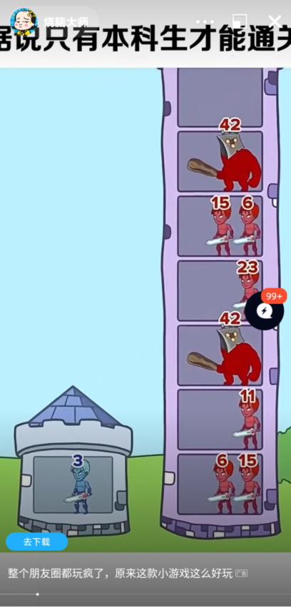
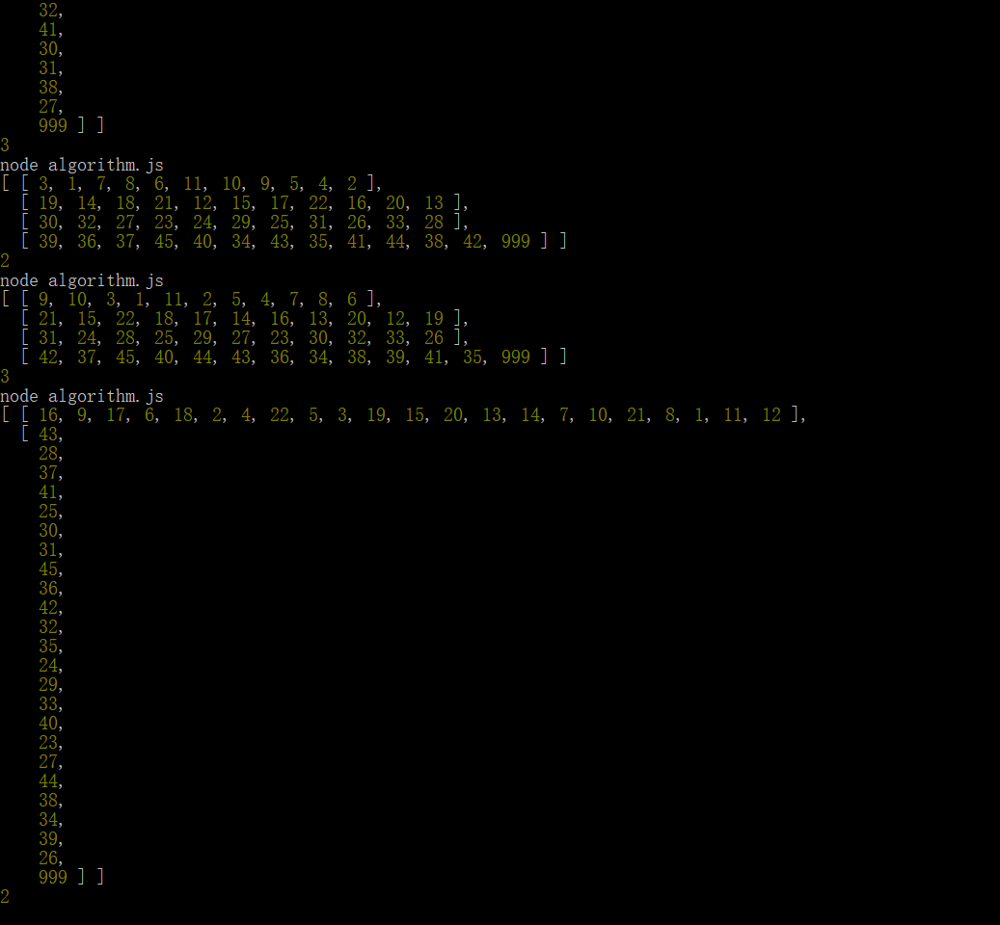

canvas-腾讯小游戏推广-沙雕塔 目录：

[TOC]

---

# 前言

- 腾讯每次推广的游戏都是挂羊头卖狗肉
- 针对一个垃圾小游戏的逆向算法猜测

# 游戏界面



# 怪物等级和位置生成算法

```js
// 初始英雄等级生成器
const Hero = function(limitLevel, minLevel){
    return  Math.floor(Math.random()*limitLevel + minLevel);
}

// 怪物等级分区和生成器
const Enemy = function(maxLevel, districtNum){
    let enemys = [],
        enemy = [],
        enemyDistrict = [],
        district = Math.floor(Math.random()*districtNum+1);

    for(let m = 1, sum = 0; sum <= maxLevel; m++){    
        sum +=m;        
        enemy.push(m);
    }
// 随机等级，但会出现bug
/*     let sum = 0;
    while(sum <= maxLevel){
        let m = Math.floor(Math.random()*100+1);
        sum += m
        enemy.push(m);
    }
	console.log(`enemy:${enemy}`); */

    for(let i = 1, start = 0; i <= district; i++){
        // console.log(i);
        let w = i*enemy.length / district;
        enemyDistrict.push(enemy.slice(start,w));
        start = w;
    }

	
    for(let i = 0; i < enemyDistrict.length; i++){
        // console.log(`${enemyDistrict[i].Yates()}`);
        enemys.push(enemyDistrict[i].shuffle());        
    }
	enemys = enemys.length <= 0 ? enemyDistrict : enemys;
    enemys[enemys.length - 1].push(maxLevel);

    return enemys;
};

// 随机生成算法
// 1.shuffle
Array.prototype.shuffle = function() {
    let m = this.length,
        t,
        i;
    
    while(m){
        i = Math.floor(Math.random() * m--);
        t = this[m];
        this[m] = this[i];
        this[i] = t;
    }

    return this;
};

// 2.Fisher-Yates
Array.prototype.Yates = function(){
    let arr = this;

    for(let i = 0; i < arr.length; i++){
        const random = Math.floor(Math.random() * (i+1));
        [arr[i], arr[random]] = [arr[random], arr[i]];
    }
    return arr;
}
```

# 测试代码

```js
// 测试结果总是大于最终BOSS怪物(999)
// test sample
/* enemyDistrict.map(val=>{
    val.map((lval) => {
        start += lval;
        console.log(lval, start);
    });
}); */
let test = Enemy(999, 5);
console.log(test);

let start = Hero(3,1);
console.log(start);
```

# 测试结果



