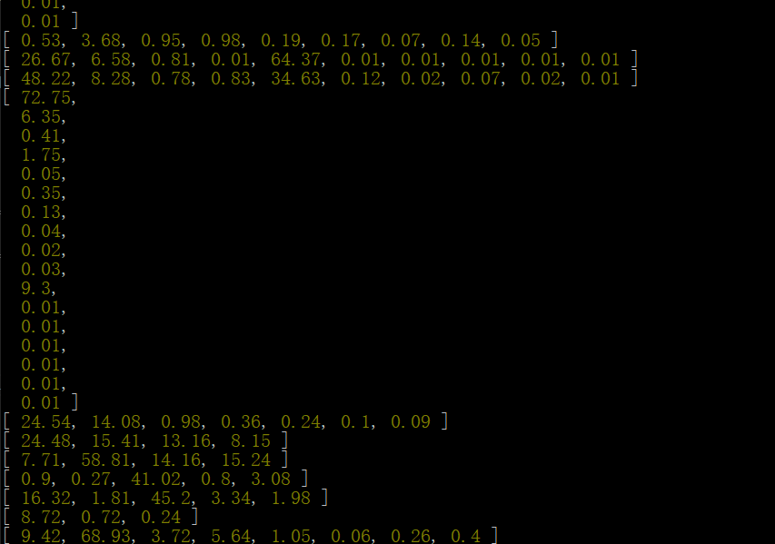
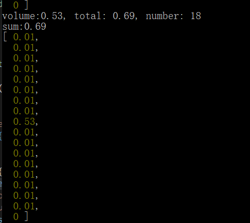

js-指定红包顺序和金额的算法 目录
[TOC]
***

# 前言

- 朋友拜托而写
- 单个包最小金额为`0.01`
- 如果除指定金额外，其余都为`0.01`，最后尾包存在为`0`的几率
- 本算法通过了`1000000`次测试，出错率为百万分之3

# 效果展示



# 空包问题



# 红包算法

```js
/*
    param: float, int, int, float
    param1:红包金额总额
    param2:红包数目
    param3:指定特殊红包
    param4:指定特殊红包金额
 */
let getPrize = function(total, number, index, volume){
    let allowance = total - volume;

    let arr = [];
    let i = 0;
    while(i < number - 2){
        // 指定[0.01,allowance-(i*0.01))
        let temp = (Math.random()*(allowance - (number - 1 - i) * 0.01) + 0.01).toFixed(2);
        // if(temp < 0)    console.log(`temp:${temp}`);
        temp = temp <= 0 ? 0.01 : temp;        
        arr.push(parseFloat(temp));
        allowance = parseFloat((allowance - temp).toFixed(2));        
        i++;
        // console.log(`arr:${arr}, i:${i}`);
        // 如果出现小于0的分配情况，剥削强者均分
        if(allowance <= 0){
            // console.log(`alowance:${allowance}`);
            
            
            let w = arr.filter((val,index)=>{
                // console.log(`val:${val}`);
                if(val > 0.01){
                    
                    arr[index] = parseFloat((arr[index] - 0.01).toFixed(2));
                    return val;
                }
            });

            if(w.length == 0){
                allowance = 0;
            }else{
                allowance = 0.01;
            }
            
        }
    }
    // 最后一个放入
    arr.push(parseFloat(allowance.toFixed(2)));
    let result = arr;

    return result.slice(0, index).concat(parseFloat(volume), result.slice(index));
}

```

# 测试样例

```js
// Test sample
for(let m = 0; m < 10000; m++){
    let total = (Math.random()*100 + 0.01).toFixed(2);

    let number = Math.floor(Math.random()*20 +2);
    while(total / number < 0.01){
        number = Math.floor(Math.random()*20 +2);
    }

    let index = Math.floor(Math.random()*(number - 1));

    let volume = (Math.random()*(total - 0.01*(number-1))+0.01).toFixed(2);
    while(volume >= total || volume + 0.01*(number-1) > total){
        // console.log(`xx:${volume}`);
        volume = (Math.random()*(total - 0.01*(number-1))+0.01).toFixed(2);
        volume = volume <= 0 ? 0.01 : volume;
    }
    
    
    let test = getPrize(total, number, index, volume);
    // console.log(test);
    let sum  = test.reduce((total,val)=>total+=parseFloat(val));
    sum = sum.toFixed(2);
    if(sum !== total) {
        console.log(`volume:${volume}, total: ${total}, number: ${number}`);
        console.log(`sum:${sum}`);
        console.log(test);
    }
    test.map((val,index)=>{
        if(val <= 0 && index !== test.length - 1){
            console.log(`volume:${volume}, total: ${total}, number: ${number}`);
            console.log(`sum:${sum}`);
            console.log(test);
        }
    });

}


```

