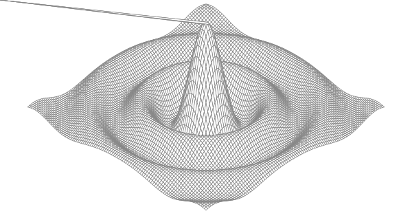

svg-利用js-go生成仿真图 目录

[TOC]

****

# 前言

- 本程序基于`svg`建立的仿真图

注意：

- `js`生成对资源占用极大，建议使用`worker`，最好是在后台生成后，前端只是展现结果
- 文末附有`golang`程序

# 结果展示



# 代码展示

```js
let testSvg = function(){
    this.width = 600,
    this.height = 320,
    this.cells = 100,
    this.xyrange = 30.0,
    this.xyscale = this.width / 2 / this.xyrange,
    this.zscale = this.height * 0.4,
    this.angle = Math.PI / 6,
    this.sx,
    this.sy,
    this.sinNum = Math.sin(this.angle),
    this.cosNum = Math.cos(this.angle);
    // this.dis = new Map();
}

// testSvg.prototype.sinNum = Math.sin(this.angle);
// testSvg.prototype.cosNum = Math.cos(this.angle);

testSvg.prototype.compute = function(i, j) {
    let r = Math.hypot(i, j);

    return Math.sin(r) / r;
}

testSvg.prototype.corner = function(i, j) {
    let x = this.xyrange * (parseFloat(i) / this.cells - 0.5),
        y = this.xyrange * (parseFloat(j) / this.cells - 0.5);
        
    let z = this.compute(x, y);
    
    // if(this.dis.has('sx'))    this.dis.delete('sx');
    // this.dis.set('sx', this.width/2+(x-y)*this.cosNum*this.xyscale);
    this.sx = this.width/2+(x-y)*this.cosNum*this.xyscale;
    
    // if(this.dis.has('sy'))    this.dis.delete('sy');
    // this.dis.set('sy', this.height/2+(x+y)*this.sinNum*this.xyscale - z*this.zscale);
    this.sy = this.height/2+(x+y)*this.sinNum*this.xyscale - z*this.zscale;    
}

testSvg.prototype.getval = function(x, y){
    this.corner(x,y);
    let arr = [];
    arr.push(this.sx,this.sy);
    // console.log(this.sx)
    return arr.join(',');
}

testSvg.prototype.main = function() {
    let svgtag = document.createElement('svg');
    svgtag.setAttribute('xmlns', "http://www.w3.org/2000/svg");
    svgtag.style = "stroke: grey; stroke-width: 0.7";
    svgtag.fill = "white"; 
    svgtag.width= this.width;
    svgtag.height=this.height;

    document.body.appendChild(svgtag);
    let tag = [];    
    for(let i = 0; i < this.cells; i++){
        for(let j = 0; j < this.cells; j++){            
            let ax = this.getval(i+1,j),
                bx = this.getval(i,j),
                cx = this.getval(i,j+1),
                dx = this.getval(i+1,j+1);
            tag.push(`<polygon points='${ax} ${bx} ${cx} ${dx}' />`)
        }
    }

    tag.map(val=>{
        console.log(val);
        svgtag.innerHTML += val;
    });
}

let test = new testSvg();
test.main();
```

# `go`展示

```go
// Surface computes an SVG rendering of a 3-D surface function.
package main

import (
    "fmt"
    "math"
)

const (
    width, height = 600, 320            // canvas size in pixels
    cells         = 100                 // number of grid cells
    xyrange       = 30.0                // axis ranges (-xyrange..+xyrange)
    xyscale       = width / 2 / xyrange // pixels per x or y unit
    zscale        = height * 0.4        // pixels per z unit
    angle         = math.Pi / 6         // angle of x, y axes (=30°)
)

var sin30, cos30 = math.Sin(angle), math.Cos(angle) // sin(30°), cos(30°)

func main() {
    fmt.Printf("<svg xmlns='http://www.w3.org/2000/svg' "+
        "style='stroke: grey; fill: white; stroke-width: 0.7' "+
        "width='%d' height='%d'>", width, height)
    for i := 0; i < cells; i++ {
        for j := 0; j < cells; j++ {
            ax, ay := corner(i+1, j)
            bx, by := corner(i, j)
            cx, cy := corner(i, j+1)
            dx, dy := corner(i+1, j+1)
            fmt.Printf("<polygon points='%g,%g %g,%g %g,%g %g,%g'/>\n",
                ax, ay, bx, by, cx, cy, dx, dy)
        }
    }
    fmt.Println("</svg>")
}

func corner(i, j int) (float64, float64) {
    // Find point (x,y) at corner of cell (i,j).
    x := xyrange * (float64(i)/cells - 0.5)
    y := xyrange * (float64(j)/cells - 0.5)

    // Compute surface height z.
    z := f(x, y)

    // Project (x,y,z) isometrically onto 2-D SVG canvas (sx,sy).
    sx := width/2 + (x-y)*cos30*xyscale
    sy := height/2 + (x+y)*sin30*xyscale - z*zscale
    return sx, sy
}

func f(x, y float64) float64 {
    r := math.Hypot(x, y) // distance from (0,0)
    return math.Sin(r) / r
}
```

